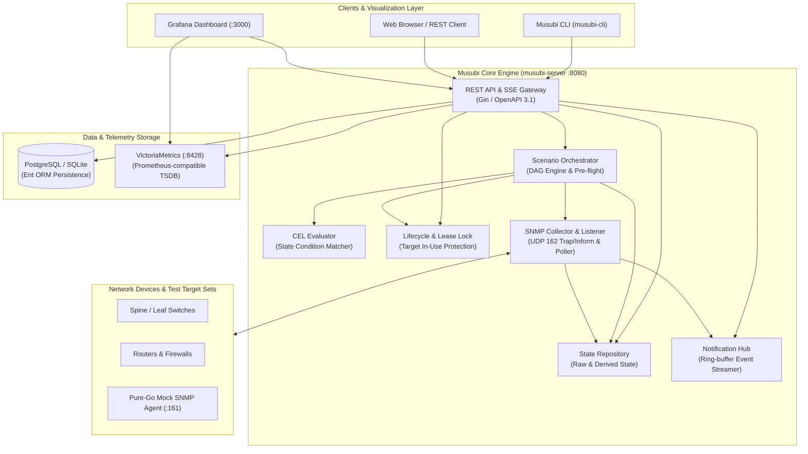
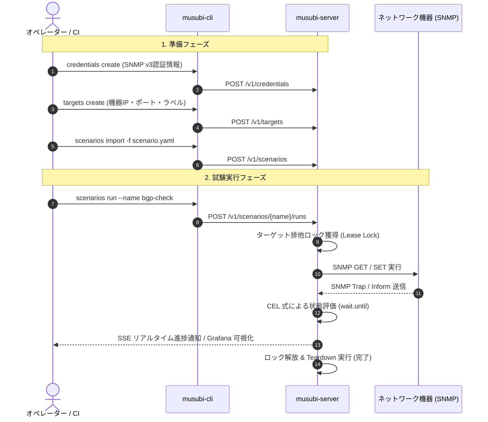

# Musubi (結び) - Air-gapped SNMP Scenario Orchestrator

[](https://github.com/sh0jitmy/Musubi/actions/workflows/ci.yml)
[](https://goreportcard.com/report/github.com/sh0jitmy/musubi)
[](LICENSE)
[](api/openapi.yaml)

**Musubi (結び)** は、エアギャップ（完全隔離）環境での自律稼働を前提に設計された、**高信頼・高性能なイベント駆動型 SNMP ネットワーク自動試験・状態監視プラットフォーム**です。

複数の SNMP Agent（ルータ、スイッチ、サーバー等のネットワーク機器）に対して、宣言的な YAML シナリオに基づく自動試験、SNMP Trap / Inform 連動のリアルタイム検証、CEL (Common Expression Language) による型安全な状態評価、排他リースロックによる機器保護を提供します。

---

## 🌟 主な特徴 (Key Features)

* 🔒 **Air-gapped ＆ ゼロ外部依存設計**: インターネット接続のない隔離ラボ環境でも、単一バイナリおよび Docker Compose で完結稼働。
* ⚡ **ミリ秒級のイベント駆動アーキテクチャ**: ポーリング待ちによるタイムラグを排し、SNMP Trap / Inform 受信と同時に CEL 条件評価を実行してシナリオを即座に進捗。
* 📐 **CEL (Common Expression Language) による宣言的評価**: `raw['spine1']['IF-MIB::ifOperStatus.1'] == 'up'` のような直感的で高速・型安全な条件判定。
* 🛡️ **Lease Lock によるターゲット保護**: 複数エンジニアや並行テストによるターゲット機器の競合や誤設定変更を自動でブロック。
* 📊 **統合オブザーバビリティ (VictoriaMetrics & Grafana)**: CPU・メモリ・帯域・SNMP テレメトリ・MIB テーブル・Trap ログをリアルタイム可視化する公式ダッシュボードを同梱。
* 🧩 **OpenAPI 3.1 & REST / SSE API 完備**: 全機能を標準化された RESTful API および SSE (Server-Sent Events) ストリームで外部公開。CLI (`musubi-cli`) も標準提供。

---

## 🏗️ システムアーキテクチャ (Architecture Overview)

Musubi は「モジュラーモノリス (Modular Monolith) ＆ マイクロサービス対応」アーキテクチャを採用しており、高スループットな非同期処理と明確なドメイン境界を備えています。



---

## 📁 リポジトリ構成 (Repository Structure)

```
Musubi/
├── api/
│   └── openapi.yaml               # OpenAPI 3.1 API 完全定義仕様書
├── cmd/
│   ├── musubi-server/             # Musubi メインサーバーバイナリ
│   ├── musubi-cli/                # 運用・自動化用 CLI ツール
│   └── mock-snmp-agent/           # テスト・検証用 Pure-Go Mock SNMP エージェント
├── deploy/
│   ├── grafana/                   # Grafana プロビジョニング設定 & 監視ダッシュボード
│   └── victoriametrics/           # VictoriaMetrics (TSDB) 設定
├── docs/
│   ├── user_manual.md             # 📖 エンドユーザー向け完全利用マニュアル
│   ├── architecture.md            # 🏛️ 詳細アーキテクチャ設計仕様書
│   ├── maintenance_guide.md       # 🔧 メンテナー向け保守・トラブルシューティングガイド
│   └── adr/                       # アーキテクチャ決定記録 (ADR)
├── ent/                           # Ent ORM スキーマ定義 & 自動生成コード
├── internal/
│   ├── collector/                 # SNMP Trap/Inform リスナー & SNMP クライアント
│   ├── common/                    # 共通基盤 (errors, batcher, lifecycle, telemetry, notification)
│   ├── database/                  # DB 接続 & 初期シード管理
│   ├── gateway/                   # REST API ルーター & ミドルウェア
│   ├── orchestrator/              # シナリオパーサー, プリフライト検証, ジョブランナー
│   ├── state/                     # CEL 評価エンジン & 状態リポジトリ
│   └── testutil/                  # テスト用ユーティリティ & Mock SNMP Agent
├── scripts/
│   ├── demo.sh                    # フルスタック動作確認用ワンコマンドデモ
│   └── docker_e2e.sh              # Docker Compose E2E 自動テストスイート
├── docker-compose.yml             # コンテナ一括起動用 Docker Compose 定義
├── Dockerfile                     # マルチステージビルド Dockerfile
├── Makefile                       # ビルド・テスト・静的解析自動化 Makefile
├── REQUIREMENTS.md                # 要件チェックリスト & 自己評価レポート
└── README.md                      # 本ドキュメント
```

---

## 🚀 クイックスタート (Quick Start)

### 1. Docker Compose での一括起動 (推奨)

```bash
# スタック全体のビルド & 起動 (Musubi, Mock Agent, VictoriaMetrics, Grafana)
docker compose up -d --build

# 起動状態のヘルスチェック
curl -s http://localhost:8080/v1/system/healths | jq .
```

* 🌐 **REST API & Swagger/OpenAPI**: `http://localhost:8080/v1/system/healthz`
* 📊 **Grafana ダッシュボード**: `http://localhost:3000/d/musubi-overview`
* 📈 **VictoriaMetrics TSDB**: `http://localhost:8428`

---

### 2. ワンコマンド デモスクリプトの実行

スタックの起動から、認証プロファイル作成、ターゲット登録、シナリオ登録、ジョブ実行までを完全自動で体験できます：

```bash
./scripts/demo.sh
```

---

### 3. ローカルバイナリのビルドと起動

```bash
# 全バイナリを bin/ に一括ビルド
make build

# サーバーの起動 (ポート 8080, UDP 162 でリスン)
./bin/musubi-server

# CLI ヘルプの確認
./bin/musubi-cli --help
```

---

## 💡 基本的な使い方 (Basic Usage Workflow)



### ステップ 1: 認証プロファイル & ターゲット登録
```bash
# SNMP v3 認証プロファイル作成
./bin/musubi-cli credentials create \
  --name "v3-admin" \
  --version "v3" \
  --sec-level "authPriv" \
  --username "admin" \
  --auth-proto "SHA256" --auth-pass "AuthPass123!" \
  --priv-proto "AES"    --priv-pass "PrivPass123!"

# ターゲット機器登録
./bin/musubi-cli targets create \
  --name "spine1" \
  --host "192.168.10.1" \
  --port 161 \
  --credential "v3-admin" \
  --labels "role=spine,site=dc1"
```

### ステップ 2: シナリオ YAML の作成と登録
```yaml
# scenarios/linkdown.yaml
name: "spine1-failover-test"
target_locks: ["spine1"]
steps:
  - id: "check_link_up"
    target: "spine1"
    wait:
      until: "raw['spine1']['IF-MIB::ifOperStatus.1'] == 'up'"
      timeout: "5s"
  - id: "inject_link_down"
    target: "spine1"
    action: "action.snmp_set"
    params:
      oid: "1.3.6.1.2.1.2.2.1.7.1"
      type: "int"
      value: 2
teardown:
  - id: "restore_link"
    target: "spine1"
    action: "action.snmp_set"
    params:
      oid: "1.3.6.1.2.1.2.2.1.7.1"
      type: "int"
      value: 1
```

```bash
# シナリオのインポート
./bin/musubi-cli scenarios import --file ./scenarios/linkdown.yaml
```

### ステップ 3: シナリオ実行 & 進捗確認
```bash
# シナリオの実行
./bin/musubi-cli scenarios run --name "spine1-failover-test"

# ジョブのステータス & ログ確認
./bin/musubi-cli jobs status --id "<JOB_ID>"
./bin/musubi-cli jobs logs --id "<JOB_ID>"
```

---

## 📊 Grafana モニタリングダッシュボード

Musubi には、VictoriaMetrics と連携した公式 Grafana ダッシュボードがプリセットされています。

* **URL**: `http://localhost:3000/d/musubi-overview`

```
┌────────────────────────────────────────────────────────────────────────────────────────┐
│  Musubi System Overview & Live Telemetry Dashboard                                     │
├────────────────────────────────┬───────────────────────┬───────────────────────────────┤
│  ⚡ CPU Utilization           │  🧠 Memory Usage      │  🌐 Network Bandwidth (Rx/Tx) │
│  [======== 4.2% ========]      │  [==== 18.5 MB =====] │  Rx: 1.2 MB/s | Tx: 850 KB/s  │
├────────────────────────────────┴───────────────────────┴───────────────────────────────┤
│  📊 Live SNMP Telemetry & Trap Operations                                              │
│  - Total Traps Received: 1,420 pkts/s      - SNMP Operations P95: 1.8 ms               │
│  - Active Target Locks : 2 locked          - Running Jobs Count : 1 running            │
├────────────────────────────────────────────────────────────────────────────────────────┤
│  🎯 Target Selector: [ spine1 ▼ ]                                                      │
│  - Latest MIB Data Tree Table (IF-MIB, IP-MIB, HOST-RESOURCES-MIB, BGP4-MIB)           │
│  - Real-time Trap/Inform Audit Logs Stream Table                                       │
└────────────────────────────────────────────────────────────────────────────────────────┘
```

---

## 📚 ドキュメント一覧 (Documentation Index)

| ドキュメント | 対象読者 | 主な内容 |
| :--- | :--- | :--- |
| 📖 [ユーザー利用マニュアル](docs/user_manual.md) | 利用者・オペレーター | 実行方法、シナリオ作成詳細、CEL式リファレンス、運用手順、トラブルシューティング |
| 🏛️ [アーキテクチャ設計仕様書](docs/architecture.md) | 設計者・アーキテクト | モジュラーモノリス設計、ドメイン境界、シーケンス図、ライフサイクル置換表 |
| 🔧 [メンテナー向け保守ガイド](docs/maintenance_guide.md) | メンテナー・開発者 | 内部実装構造、カバレッジ基準 (80%+)、静的解析、デバッグ手順 |
| 📄 [OpenAPI 3.1 仕様書](api/openapi.yaml) | API 連携開発者 | RESTful API エンドポイント、リクエスト/レスポンス JSON スキーマ定義 |

---

## ⚙️ 開発・検証コマンド一覧 (Development Commands)

| コマンド | 説明 |
| :--- | :--- |
| `make fmt` | ソースコードのフォーマット (`go fmt` / リンター自動修正) |
| `make lint` | `golangci-lint` による全パッケージの厳格な静的解析 |
| `make test` | データ競合検知 (`-race`) および 80% 基準カバレッジ測定付きテスト実行 |
| `make build` | `bin/` 配下への全実行可能バイナリ (`musubi-server`, `musubi-cli`, `mock-snmp-agent`) コンパイル |
| `make docker-test` | Docker Compose 環境での E2E 自動検証スクリプト実行 |
| `make openapi-lint` | Spectral による OpenAPI 3.1 スキーマ文法検証 |
| `make clean` | 一時ファイル、バイナリ成果物、テストキャッシュの削除 |

---

## 📄 ライセンス (License)

本プロジェクトは **Apache License 2.0** の下で公開されています。詳細については [LICENSE](LICENSE) ファイルをご参照ください。
