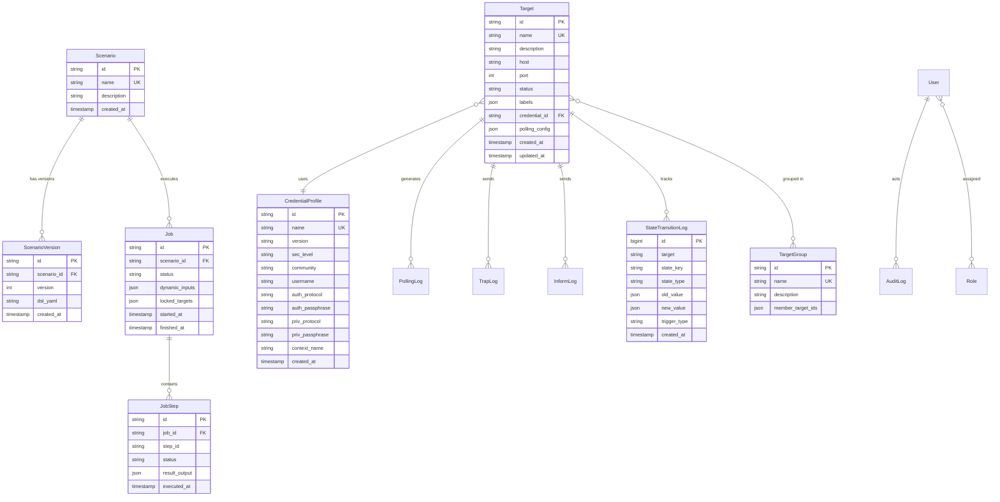

# SNMP Scenario Orchestrator (Musubi) Architecture Design Specification

**Version:** 1.1 (Modular Monolith & Microservices Architecture)  
**Status:** Approved  
**Author:** Architecture & Engineering Team  

---

## 1. エグゼクティブサマリー & 設計原則 (Executive Summary & Core Tenets)

**SNMP Scenario Orchestrator (Musubi)** は、複数の SNMP Agent（ネットワーク機器）に対してシナリオベースで自動試験・状態監視・イベント駆動制御を実行する OSS ネットワーク試験基盤です。

単一のモノリス構造における障害波及リスク（Trap フラッドやポーリング遅延による API やシナリオエンジンの巻き添え停止）を排除するため、**「モジュラーモノリス (Modular Monolith) ＆ マイクロサービス対応 (Microservices-Ready)」** アーキテクチャを採用しています。

### コア設計原則 (Core Tenets)

```
┌──────────────────────────────────────────────────────────────────────────┐
│                             CORE TENETS                                  │
├──────────────────────────────────────────────────────────────────────────┤
│ 1. Event Driven       : Trap/Inform/Pollingを契機とした非同期イベント駆動 │
│ 2. State Driven       : SNMP直結を排し、Raw/Derived Stateに基づくCEL評価 │
│ 3. Protocol Agnostic  : Scenario Engine は SNMP を知らず Action Plugin化 │
│ 4. Clear Boundaries   : NotificationHub(配送) と StateService(状態)の分離│
│ 5. API-First Design   : OpenAPI 3.1 準拠、全機能を REST/WS で外部公開     │
│ 6. Pure-Go Testing    : 外部依存無しの純Go gosnmp Mock Agent による多系試験│
│ 7. Modular Monolith   : 4つの独立ドメインモジュールによる障害隔離＆       │
│    & Microservices    : 単一バイナリ (ラップトップ) / 分散コンテナ両対応 │
└──────────────────────────────────────────────────────────────────────────┘
```

---

## 2. 全体システムアーキテクチャ (Modular Monolith & Microservices)

システムは明確な境界を持つ **4 つの独立ドメインモジュール (Bounded Contexts)** で構成され、プロセス内インターフェースまたは gRPC/PubSub を介して疎結合に連携します。

```mermaid
graph TB
    subgraph Clients["Clients & Visualization Layer"]
        CLI["Musubi CLI (urfave/cli)"]
        UserUI["Custom User Frontend / CI-CD"]
        EmbedUI["Musubi Embedded Web UI (embed.FS - SSE)"]
        Grafana["Grafana (Dashboards & Infinity Plugin)"]
    end

    subgraph ModuleGateway["1. Gateway Module (musubi-gateway)"]
        REST["REST API Server (OpenAPI 3.1)"]
        SSE["SSE & Long-Polling Event Streamer"]
        Auth["Auth & Casbin RBAC Middleware (JWT / Casbin)"]
    end

    subgraph ModuleOrchestrator["2. Orchestrator Module (musubi-orchestrator)"]
        ScenarioEngine["Scenario Engine (DSL / Context)"]
        CELEval["CEL Evaluator (wait.until)"]
        ActionEngine["Action Engine (Plugin Manager)"]
        ActionPlugins["Action Plugins (snmp, sleep, custom)"]
    end

    subgraph ModuleState["3. State Service Module (musubi-state)"]
        StateService["StateService (Diff & Transition Engine)"]
        RawState["Raw State Store (SNMP Data)"]
        DerivedState["Derived State Store (Context)"]
    end

    subgraph ModuleCollector["4. SNMP Collector Module (musubi-collector)"]
        TrapReceiver["Trap / Inform Receiver (UDP 162 - 0xA2 ACK)"]
        PollingEngine["1s Fast Poller & 10min BulkGet Engine"]
        SNMPClient["gosnmp Client Pool"]
        MIBManager["MIB Registry (OID Lookup & Tree)"]
    end

    subgraph MetricsObservability["Metrics & TSDB Layer (VictoriaMetrics)"]
        VictoriaMetrics["VictoriaMetrics (OSS TSDB /metrics Scrape)"]
    end

    subgraph PersistenceLayer["Persistence & Maintenance Layer (PostgreSQL)"]
        EntDB[("PostgreSQL Database")]
        BackupWorker["Backup & Restore / Retention Worker"]
    end

    subgraph Targets["Target Devices & Test Environment"]
        DeviceSpine1["Spine1 (128 Target Sets)"]
        DeviceSpine2["Spine2 (128 Target Sets)"]
        MockAgents["Pure-Go Mock SNMP Agents (testutil)"]
    end

    %% Client connections
    CLI --> REST
    CLI --> SSE
    UserUI --> REST
    UserUI --> SSE
    EmbedUI --> REST
    EmbedUI --> SSE
    Grafana --> REST
    Grafana --> VictoriaMetrics

    %% Gateway to Services
    REST --> Auth
    SSE --> Auth
    Auth --> ScenarioEngine
    Auth --> StateService
    Auth --> MIBManager

    %% Metrics Collection
    VictoriaMetrics -.->|Scrape /metrics| ModuleGateway
    VictoriaMetrics -.->|Scrape /metrics| ModuleOrchestrator
    VictoriaMetrics -.->|Scrape /metrics| ModuleState
    VictoriaMetrics -.->|Scrape /metrics| ModuleCollector

    %% Core interactions
    ScenarioEngine --> CELEval
    ScenarioEngine --> ActionEngine
    CELEval -.->|Read State| StateService
    NotificationHub -.->|Dispatch Notice| ScenarioEngine
    NotificationHub -.->|Stream Events (SSE)| SSE

    ActionEngine --> ActionPlugins
    ActionPlugins -.->|SNMP Requests| SNMPClient
    ActionPlugins -.->|Targets| Targets

    %% State Service & Store
    StateService --> RawState
    StateService --> DerivedState
    StateService -->|StateChangedNotice| NotificationHub
    StateService -->|Record Transition| EntDB

    %% SNMP Subsystem
    TrapReceiver -->|Update Raw| StateService
    TrapReceiver -->|Send ACK 0xA2| Targets
    TrapReceiver -->|Trap/Inform Notice| NotificationHub
    PollingEngine -->|GET/BULKGET| SNMPClient
    PollingEngine -->|Update Raw| StateService
    SNMPClient --> Targets

    Targets --> TrapReceiver

    %% Persistence
    ScenarioEngine --> EntDB
    BackupWorker --> EntDB
```

---

## 3. レイヤー別パッケージ構成 & DDD 設計 (Clean DDD Architecture & Shared Kernel)

Go のベストプラクティスに基づき、**DDD (ドメイン駆動設計) ＆ レイヤードアーキテクチャ (Clean/Hexagonal)** を採用しています。
サービス間で共通する処理（エラーハンドリング、バッチ書き込み、メトリクス、イベント配送）は **Shared Kernel (`internal/common`)** に集約し、車輪の再発明や実装の重複を徹底排除しています。

```
musubi/
├── api/
│   ├── openapi.yaml                 # OpenAPI 3.1 完全仕様書
│   └── oapi-codegen.cfg.yaml        # REST コード生成設定
├── cmd/
│   ├── app/                         # サーバーバイナリエントリポイント (Modular Monolith)
│   │   ├── main.go
│   │   └── main_test.go
│   └── musubi-cli/                  # 運用・CI/CD 用 CLI ツール (urfave/cli)
│       └── main.go
├── config/                          # アプリケーション設定 & RBAC ポリシー
│   ├── config.go
│   ├── config.yaml
│   ├── rbac_model.conf              # Casbin RBAC モデル定義
│   └── rbac_policy.csv              # 初期ロール・権限定義
├── docs/                            # アーキテクチャドキュメント & ADR
│   ├── architecture.md
│   └── adr/
├── ent/                             # Ent ORM スキーマ (単一の真実のデータモデル)
│   ├── schema/
│   │   ├── scenario.go              # シナリオ定義
│   │   ├── scenarioversion.go       # シナリオバージョン履歴 (YAML保管)
│   │   ├── target.go                # 監視対象機器
│   │   ├── credential.go            # SNMP v1/v2c/v3 認証プロファイル
│   │   ├── job.go                   # シナリオ実行インスタンス
│   │   ├── jobstep.go               # Step 実行履歴 & 出力
│   │   ├── traplog.go               # 受信 Trap ログ
│   │   ├── informlog.go             # 受信 Inform & ACK 返信ログ
│   │   ├── pollinglog.go            # 定期 Polling 観測ログ (Change-Only)
│   │   ├── statetransitionlog.go    # 状態変化 (State Transition) ログ
│   │   ├── user.go                  # ユーザー・ロール
│   │   └── auditlog.go              # API・操作監査ログ (360日保管)
│   └── generate.go
├── internal/
│   ├── common/                      # ★ Shared Kernel (全モジュール共通基盤)
│   │   ├── errors/                  # 共通ドメインエラー & HTTP/CLI コードマッピング
│   │   │   ├── errors.go            # AppError (Code, Message, Details, HTTPStatus)
│   │   │   └── codes.go             # ErrNotFound, ErrConflict, ErrTimeout, ErrValidation
│   │   ├── batcher/                 # 汎用非同期バッチ書き込み基盤 (RingBuffer)
│   │   │   └── batch_writer.go      # Log / Transition / Metrics 書き込み共通化
│   │   ├── notification/            # In-Process Pub/Sub Hub (Event Plane)
│   │   │   ├── hub.go               # NotificationHub インターフェース & 実装
│   │   │   ├── notice.go            # Notice, NoticeType 定義
│   │   │   └── subscriber.go        # バッファ付きサブスクライバー
│   │   ├── telemetry/               # OpenTelemetry & VictoriaMetrics 基盤
│   │   │   ├── tracer.go            # Context Propagation & Trace
│   │   │   └── metrics.go           # PromQL 互換カウンター/ゲージ/ヒストグラム
│   │   ├── lifecycle/               # Graceful Shutdown & ヘルスチェック基盤
│   │   │   └── manager.go           # SIGINT/SIGTERM シグナル・Drain 協調
│   │   └── types/                   # 共通 Value Object (UUID, Timestamp, Pagination)
│   │
│   ├── collector/                   # 【Bounded Context 1: SNMP Collector】
│   │   ├── domain/                  # 純粋ドメイン層 (Entities, VOs, Repositories)
│   │   │   ├── target.go            # Target, CredentialProfile Entity
│   │   │   ├── packet.go            # SNMPPDU, TrapPacket, InformPacket VO
│   │   │   ├── repository.go        # TargetRepo, TrapLogRepo インターフェース
│   │   │   └── events.go            # TrapReceivedEvent, PollingCompletedEvent
│   │   ├── application/             # ユースケース層
│   │   │   ├── trap_receiver_uc.go  # 即時 0xA2 ACK 返信 & イベント発行
│   │   │   ├── fast_poll_uc.go      # 1s/1OID 高速ポーリング & 差分チェック
│   │   │   └── bulk_poll_uc.go      # 10min Jitter BulkGet テーブル取得
│   │   └── infrastructure/          # インフラ層 (gosnmp, UDP Socket, Ent Repo)
│   │       ├── snmp_client_pool.go  # gosnmp コネクションプール
│   │       ├── udp_trap_listener.go # 4MB 受信バッファ付き UDP 162 リスナー
│   │       ├── mib_registry.go      # MIB 解析・OID 逆引きテーブル
│   │       └── ent_target_repo.go   # Ent ORM アダプター
│   │
│   ├── state/                       # 【Bounded Context 2: State & Transition】
│   │   ├── domain/                  # 純粋ドメイン層
│   │   │   ├── state_key.go         # raw.<target>.<oid>, derived.<ns>.<key> VO
│   │   │   ├── transition.go        # State Transition Entity
│   │   │   ├── repository.go        # StateStore, TransitionLogRepo インターフェース
│   │   │   └── events.go            # StateChangedEvent
│   │   ├── application/             # ユースケース層
│   │   │   ├── update_state_uc.go   # 新旧差分検知 (Diff) & StateChangedNotice
│   │   │   └── query_state_uc.go    # 状態一覧・変化履歴クエリ
│   │   └── infrastructure/          # インフラ層
│   │       ├── sharded_memory_store.go # Target 別 Sharded RWMutex インメモリストア
│   │       └── ent_transition_repo.go  # Ent ORM + Batcher 永続化アダプター
│   │
│   ├── orchestrator/                # 【Bounded Context 3: Scenario Engine】
│   │   ├── domain/                  # 純粋ドメイン層
│   │   │   ├── scenario.go          # Scenario, Version, Job, JobStep Entity
│   │   │   ├── dsl.go               # AST 構文木 & Step 定義
│   │   │   ├── cel_evaluator.go     # CEL Engine ドメインインターフェース
│   │   │   ├── action_plugin.go     # ActionPlugin ドメインインターフェース
│   │   │   ├── repository.go        # ScenarioRepo, JobRepo インターフェース
│   │   │   └── events.go            # JobStarted, StepAdvanced, JobFinished Events
│   │   ├── application/             # ユースケース層
│   │   │   ├── run_scenario_uc.go   # シナリオ実行・Step 並列 Join / Loop 制御
│   │   │   ├── resume_on_state_uc.go# StateChanged 契機の wait.until 判定
│   │   │   └── gitops_export_uc.go  # シナリオ一括 YAML エクスポート/インポート
│   │   └── infrastructure/          # インフラ層
│   │       ├── cel_engine.go        # cel-go 事前コンパイル AST キャッシュ
│   │       ├── ent_scenario_repo.go # Ent ORM アダプター
│   │       ├── ent_job_repo.go
│   │       └── plugins/             # Action Plugin 実装群
│   │           ├── snmp_get_plugin.go
│   │           ├── snmp_set_plugin.go
│   │           ├── snmp_bulk_plugin.go
│   │           └── sleep_plugin.go
│   │
│   ├── gateway/                     # 【Bounded Context 4: Presentation & API】
│   │   ├── domain/                  # 純粋ドメイン層
│   │   │   ├── auth.go              # User, Role, Session VO
│   │   │   └── repository.go        # UserRepo, AuditLogRepo インターフェース
│   │   ├── application/             # ユースケース層
│   │   │   ├── auth_uc.go           # ログイン・JWT 発行
│   │   │   └── sse_stream_uc.go     # SSE イベントストリーミング配信
│   │   └── infrastructure/          # インフラ層
│   │       ├── http/                # Gin REST Controllers & ルーティング
│   │       │   ├── router.go
│   │       │   ├── middleware/      # Casbin RBAC, JWT Auth, OTel, Masking
│   │       │   └── handler/         # Scenario, Job, State, MIB, Backup, SSE
│   │       ├── auth/                # Casbin Enforcer & JWT Signer
│   │       └── web/                 # 内蔵 Web UI (//go:embed ui/*)
│   │
│   └── testutil/                    # テスト用共通モジュール
│       └── snmpmock/                # 純Go gosnmp Mock Agent (動的ポート)
│           ├── agent.go
│           ├── pdu_handler.go
│           └── sender.go
├── web/                             # 内蔵 Scenario Runner Web UI アセット
│   ├── embed.go                     # //go:embed ui/*
│   └── ui/
│       ├── index.html
│       ├── style.css
│       └── app.js
├── docker-compose.yml               # PostgreSQL, VictoriaMetrics, Grafana, Musubi
├── go.mod
├── go.sum
└── Makefile
```

---

## 4. コンポーネント詳細設計 (Detailed Component Design)

### 4.0. DDD レイヤードアーキテクチャ & Shared Kernel 設計原則

各 Bounded Context（`collector`, `state`, `orchestrator`, `gateway`）は以下の**クリーンな 3 層構造 (Clean Architecture)** を徹底し、ドメインロジックをプロトコルや DB から完全に分離します。

```
┌────────────────────────────────────────────────────────────────────────┐
│ 1. Domain Layer (ドメイン層 - 外部依存ゼロの純粋 Go)                  │
│    ・Entities, Value Objects, Domain Events, Repository Interfaces     │
├────────────────────────────────────────────────────────────────────────┤
│ 2. Application Layer (ユースケース層)                                  │
│    ・UseCases, Command/Query Handlers, DTOs, トランザクション境界     │
├────────────────────────────────────────────────────────────────────────┤
│ 3. Infrastructure / Adapter Layer (インフラ層)                         │
│    ・Ent ORM Repositories (PostgreSQL), gosnmp, UDP Socket, Casbin     │
└────────────────────────────────────────────────────────────────────────┘
```

#### 1. Ent ORM (`entgo.io/ent`) による型安全データモデル
- すべての永続化エンティティは `ent/schema/` に単一定義され、コード生成によって型安全なクエリ・CRUD・マイグレーションを提供。
- ドメイン層の Repository Interface（例: `ScenarioRepository`）に対し、インフラ層の `ent_scenario_repo.go` が Ent Client をラップして依存関係逆転（DIP）を実現。

#### 2. Shared Kernel (`internal/common/`) による共通処理の集約
サービス間で重複しがちな横断的関心事（Cross-Cutting Concerns）を共通化し、実装の乱立を防止：
- **`internal/common/errors`**: 統一ドメインエラー型 `AppError`（Code, Message, Details, HTTPStatus, CLIErrCode）。
- **`internal/common/batcher`**: 汎用非同期バッチ書き込み基盤 `BatchWriter[T]`（RingBuffer 100件/500ms集約、ログや状態履歴の永続化で共通利用）。
- **`internal/common/notification`**: 高速 In-Process Pub/Sub Hub（`NotificationHub`）。
- **`internal/common/telemetry`**: VictoriaMetrics メトリクスおよび OpenTelemetry トレース共通関数。
- **`internal/common/lifecycle`**: シグナル（SIGINT/SIGTERM）協調、Drain、Graceful Shutdown マネージャー。

---

### 4.1. NotificationHub (`internal/common/notification`)
通知の配送（Pub/Sub）に特化した高速・非同期メッセージング機構。

```go
type NoticeType string

const (
    NoticeTrapReceived    NoticeType = "trap.received"
    NoticeInformReceived  NoticeType = "inform.received"
    NoticeStateChanged    NoticeType = "state.changed"
    NoticeJobStarted      NoticeType = "job.started"
    NoticeJobStepAdvanced NoticeType = "job.step_advanced"
    NoticeJobFinished     NoticeType = "job.finished"
    NoticeJobFailed       NoticeType = "job.failed"
)

type Notice struct {
    ID        string         `json:"id"`
    Type      NoticeType     `json:"type"`
    Target    string         `json:"target,omitempty"`
    Payload   map[string]any `json:"payload"`
    Timestamp time.Time      `json:"timestamp"`
}

type NotificationHub interface {
    Publish(notice Notice)
    Subscribe(ctx context.Context, types ...NoticeType) (<-chan Notice, func())
}
```

- **バッファリング & ノンブロッキング**: 各サブスクライバーにバッファ付きチャネルを割り当て、遅延サブスクライバーによる全体ブロックを防止。
- **クリーンアップ**: Context 完了または明示的な Unsubscribe 関数呼び出しにより、メモリリーク・goroutine リークを防止。

---

### 4.2. StateService & 2層StateStore (`internal/state`)

#### 状態の2層分離
1. **Raw State**: 外部機器（SNMP）から観測された生データを `map[Target]map[OID]Value` で保持。
2. **Derived State**: シナリオ実行によって算出された変数、フラグ、集約データを `map[Namespace]map[Key]Value` で保持。

```go
type StateStore interface {
    GetRaw(target, key string) (any, bool)
    SetRaw(target, key string, val any) (oldVal any, changed bool)
    GetAllRaw(target string) map[string]any

    GetDerived(namespace, key string) (any, bool)
    SetDerived(namespace, key string, val any) (oldVal any, changed bool)
    GetAllDerived(namespace string) map[string]any
}
```

#### 差分検知 (State Transition) フロー
`StateService.UpdateRaw` または `UpdateDerived` 呼び出し時：
1. 現在の値を StateStore から取得。
2. 新しい値と比較（`reflect.DeepEqual` またはプリミティブ比較）。
3. 変化があった場合（`changed == true`）：
   - StateStore を新値で更新。
   - `StateTransitionLog`（Target, Key, OldValue, NewValue, Trigger, Timestamp）を作成し、PostgreSQL へ非同期永続化。
   - `NotificationHub` へ `NoticeStateChanged` を発行。

---

### 4.3. Scenario Engine & CEL Evaluator (`internal/engine`)

#### シナリオ DSL 仕様 (v1alpha1)
```yaml
apiVersion: v1alpha1
name: spine-linkdown-recovery-test
description: Tests interface link down and verifies automated failover
inputs:
  target_spine:
    type: string
    default: spine1
  if_index:
    type: integer
    default: 1

steps:
  - id: step-1
    name: "Set interface down on target spine"
    action: snmp.set
    target: "${inputs.target_spine}"
    params:
      oid: "IF-MIB::ifAdminStatus.${inputs.if_index}"
      value: 2 # down (integer)

  - id: step-2
    name: "Wait until operStatus reflects down"
    wait:
      until: "raw[inputs.target_spine]['IF-MIB::ifOperStatus.' + string(inputs.if_index)] == 'down'"
      timeout: 30s
      interval: 1s

  - id: step-3
    name: "Parallel verification on redundant leaf nodes"
    parallel:
      steps:
        - action: snmp.get
          target: leaf1
          params:
            oid: "IP-FORWARD-MIB::inetCidrRouteStatus"
        - action: snmp.get
          target: leaf2
          params:
            oid: "IP-FORWARD-MIB::inetCidrRouteStatus"

  - id: step-4
    name: "Restore interface admin status"
    action: snmp.set
    target: "${inputs.target_spine}"
    params:
      oid: "IF-MIB::ifAdminStatus.${inputs.if_index}"
      value: 1 # up
```

#### CEL 式評価環境
`google/cel-go` 環境に以下の環境変数を自動注入：
- `raw`: `map[string]map[string]any`（全ターゲットの Raw State）
- `derived`: `map[string]map[string]any`（全名前空間の Derived State）
- `inputs`: シナリオ実行時に渡された動的パラメーター

---

### 4.4. Action Plugin アーキテクチャ (`internal/action`)

DSL 単体では記述が困難な複雑処理や外部連携を容易にするため、`ActionPlugin` インターフェースを定義。

```go
type ActionContext struct {
    Context      context.Context
    Target       string
    Params       map[string]any
    StateReader  state.StateReader
    StateWriter  state.StateWriter
    Logger       *slog.Logger
}

type ActionResult struct {
    Success        bool           `json:"success"`
    Output         map[string]any `json:"output,omitempty"`
    StateMutations map[string]any `json:"state_mutations,omitempty"`
    Error          error          `json:"error,omitempty"`
}

type ActionPlugin interface {
    Name() string
    Validate(params map[string]any) error
    Execute(actx *ActionContext) (*ActionResult, error)
}
```

---

### 4.5. Trap & InformRequest レシーバー (`internal/snmp`)

#### InformRequest の即時 ACK 返信シーケンス
RFC 3416 / RFC 1905 に準拠し、`gosnmp.InformRequest`（PDU Type `0xA6`）を受信した場合、直ちに送信元 Agent へ `gosnmp.GetResponse`（PDU Type `0xA2`）を返信。

```
Agent (UDP Socket)                 Musubi TrapReceiver (UDP 162)
      │                                         │
      │─── InformRequest (ReqID: 5501, OIDs) ──►│
      │                                         │ 1. Parse PDU & Varbinds
      │                                         │ 2. Build Response (PDU Type 0xA2, ReqID: 5501)
      │◄── Response (ReqID: 5501, Error: 0) ────│ 3. Sendto Agent IP:Port immediately
      │                                         │ 4. StateService.UpdateRaw(...)
      │                                         │ 5. NotificationHub.Publish(NoticeInformReceived)
      │                                         │ 6. Async DB Log (InformLog)
```

---

### 4.6. 純Go Mock SNMP Agent (`internal/testutil/snmpmock`)

外部ツール（`net-snmp` や Python `snmpsimd`）を使わずに、テスト実行時に完全インメモリで高速動作する Mock Agent を提供。

- **動的 UDP バインド**: `net.ListenUDP("udp", &net.UDPAddr{IP: net.ParseIP("127.0.0.1"), Port: 0})` で衝突なく複数起動。
- **PDU ハンドラ**: `GetRequest`, `SetRequest`, `GetBulkRequest` に応答。SET 操作で内部 OID 値をリアルタイム書き換え。
- **Trap / Inform 送信器**: テストシナリオから指示を出し、Musubi の Receiver に対して Trap / `InformRequest`（ACK 返信確認付き）を自発送信。

---

### 4.7. ログ管理 & リテンションポリシー・ストレージ設計 (`internal/logcleaner`)

Musubi は開発用ラップトップ（MacBook / 標準SSD / Docker Desktop）上でも低負荷（IOPS 100〜300、低消費電力）で軽快に動作するよう、**「差分検知時のみの記録 (Change-Only Logging)」** および **「インメモリバッファによるバッチ書き込み (Buffered Batch Insert)」** をデフォルトの基本設計として採用しています。

リテンション期間や上限レコード数はすべて `config.yaml` または環境変数からユーザーが自由に設定可能です。

#### 1. 設計基準値 (Baseline Design Values) と容量試算

ユーザー要件（**job_step_logs: 30日**, **audit_logs: 360日**, **polling_logs: 30日**, **debug_logs: 5日**, **その他: 90日**）に基づいた詳細サイジングです。

| テーブル / ログ種別 | 記録ポリシー | デフォルト保持期間 | デフォルト最大件数 (CAP) | 推定レコード単価 (Data + Index) | 推定データ容量 |
| :--- | :--- | :--- | :--- | :--- | :--- |
| **`polling_logs`** | **Change-Only** (差分・異常時のみ) | **30 日間** | **1,000,000 件** | ~450 Bytes | **約 0.45 GB** (450 MB) |
| **`job_step_logs`** | Step実行詳細・出力 | **30 日間** | **300,000 件** | ~650 Bytes | **約 0.20 GB** (200 MB) |
| **`audit_logs`** | API全要求・操作監査ログ | **360 日間** | **500,000 件** | ~600 Bytes | **約 0.30 GB** (300 MB) |
| **`debug_logs`** | アプリケーション詳細デバッグログ | **5 日間** | **300,000 件** | ~500 Bytes | **約 0.15 GB** (150 MB) |
| **`state_transition_logs`** | 状態変化記録 | **90 日間** | **1,000,000 件** | ~700 Bytes | **約 0.70 GB** (700 MB) |
| **`trap_logs`** | 受信 Trap ログ | **90 日間** | **500,000 件** | ~600 Bytes | **約 0.30 GB** (300 MB) |
| **`inform_logs`** | 受信 Inform 確達ログ | **90 日間** | **500,000 件** | ~600 Bytes | **約 0.30 GB** (300 MB) |
| その他マスタ・シナリオ・Job | 構成定義 | 永続 / 90 日間 | - | - | **約 0.05 GB** (50 MB) |

- **純粋データ ＋ インデックス実容量**: **約 2.45 GB**
- **MVCC デッドタプル・バキューム作業領域 (+35%)**: +0.85 GB
- **WAL ログバッファ (`max_wal_size`) & 一時作業領域**: +1.50 GB
- **安全マージン (ディスク使用率 70% 未満を維持)**: +1.50 GB
- **推奨プロビジョニング**: **約 5 GB 〜 7 GB** (SSD / NVMe / Docker Volume)
- **要求 IOPS**: **100 〜 300 IOPS** (Change-Only + Batch Insert により超低負荷のまま維持)

#### 2. I/O 削減アーキテクチャ詳細

1. **Change-Only Logging (差分記録)**:
   - 定期ポーリングで前回の値から変化がない正常応答は、メモリ上の `LastPolledAt` タイムスタンプのみ更新し、PostgreSQL への INSERT をスキップ。
   - 値の変動（StateTransition）またはタイムアウト・通信エラー発生時のみ DB に永続化。
2. **Buffered Batch Insert (インメモリバッチ書き込み)**:
   - `internal/database/buffer.go` がログをメモリ内キューに蓄積し、**「100 件到達」または「2 秒経過」** のタイミングでマルチ行 INSERT を一括実行。
   - トランザクションコミットおよび WAL fsync 回数を 1/100 に削減し、ディスク書き込み頻度を平滑化。
3. **Debug Log パージ**:
   - `debug_logs` はローカルファイル (`/var/log/musubi/debug.log`) または PostgreSQL に 5 日間 TTL で保存され、日次ジョブで 5 日超過分を完全パージ。

#### 3. ユーザー設定例 (`config.yaml`)

```yaml
logging:
  policy: "change_only"       # "change_only" (推奨・差分のみ) または "all" (全ポーリング記録)
  level: "INFO"               # "DEBUG", "INFO", "WARN", "ERROR"
  batch:
    max_records: 100          # バッチ書き込み件数
    flush_interval: "2s"      # フラッシュ間隔

retention:
  cleaner_schedule: "0 3 * * *" # 毎日午前3時にパージ実行
  tables:
    polling_logs:
      days: 30
      max_records: 1000000
    job_step_logs:
      days: 30
      max_records: 300000
    audit_logs:
      days: 360
      max_records: 500000
    debug_logs:
      days: 5
      max_records: 300000
    state_transition_logs:
      days: 90
      max_records: 1000000
    trap_logs:
      days: 90
      max_records: 500000
    inform_logs:
      days: 90
      max_records: 500000
```

---

### 4.8. フロントエンド & API / CLI 設計 (Web UI, SSE & CLI-First)

1. **内蔵 Web UI (`web/ui` - //go:embed による完全オフライン SPA)**:
   - `//go:embed ui/*` で単一バイナリに完全内包（外部 CDN・外部通信ゼロ）。
   - **① シナリオランナー画面 (`/ui/scenarios`)**:
     - シナリオ一覧、動的パラメータフォーム生成、ワンクリック実行、SSE によるリアルタイム Step 進捗バー・ログ表示。
   - **② ターゲット & 認証プロファイル管理画面 (`/ui/targets`)**:
     - **視覚的一覧・ステータスバッジ**: 登録機器の一覧表示とリアルタイム稼働状態（🟢 ONLINE / 🔴 OFFLINE / 🟡 TESTING・ロック中 / ⚪ MAINTENANCE）。
     - **新規登録・編集モーダル**: SNMP v1/v2c コミュニティ名、SNMPv3 USM 認証・暗号化パラメータ、ラベル、ポーリング設定を GUI から簡単入力・変更。
     - **ワンクリック 疎通テスト (SNMP Ping)**: 登録機器に対して `sysUpTime` の即時取得テストを実行し、認証エラーや疎通成否を GUI 上に即時通知。
     - **インベントリ一括インポート/エクスポート**: `targets.yaml` のドラッグ＆ドロップによる一括登録およびエクスポート。
     - **★ ターゲット作成・更新・削除 変更履歴モーダル**: 「誰が」「いつ」「何を」「どのように（Before/After 差分）」変更したかを一覧表示・確認。
   - **③ 状態インスペクター & 変化履歴画面 (`/ui/states`)**:
     - 機器別の Raw State / Derived State ツリー表示およびリアルタイム State Transition タイムライン。
   - **④ MIB ツリーブラウザー (`/ui/mibs`)**:
     - 標準・拡張 MIB の OID ツリー閲覧、シンボル名逆引き、OID サンプリング取得。

2. **REST & Server-Sent Events (SSE) API (OpenAPI 3.1 完全準拠)**:
   - `POST/GET/PUT/DELETE /api/v1/targets`: ターゲット CRUD
   - `GET /api/v1/targets/{id}/history`: **ターゲット作成・更新・削除の完全変更履歴 (Diff付き)**
   - `POST /api/v1/targets/{id}/ping`: ターゲット疎通 & SNMP 認証テスト
   - `POST/GET/PUT/DELETE /api/v1/credentials`: 認証プロファイル CRUD
   - `GET /api/v1/credentials/{id}/history`: **認証情報変更履歴 (機密マスク付き)**
   - `POST /api/v1/scenarios`: シナリオ登録
   - `POST /api/v1/scenarios/{id}/run`: パラメーター付きシナリオ実行
   - `GET /api/v1/states/raw` & `/derived`: 状態一覧
   - `GET /api/v1/states/transitions`: 状態変化履歴
   - `GET /api/v1/events/stream`: **SSE リアルタイム進捗・状態変化ストリーマー**
   - `GET /api/v1/events/poll`: **Long Polling フォールバック** (`?since=<id>&timeout=30s`)
   - `GET /api/v1/mibs/tree`: MIB ツリー構造
   - `GET /api/v1/scenarios/export` & `POST /api/v1/scenarios/import`: シナリオ一括バックアップ/復元

3. **公式 CLI ツール (`cmd/musubi-cli` / `urfave/cli`)**:
   - `musubi-cli target create / list / edit / delete / ping / import / export`
   - `musubi-cli target history <target_name>`: ターゲット変更履歴のターミナル表示
   - `musubi-cli scenario run <file.yaml> [--params k=v] [--follow]`: ターミナル上でリアルタイム SSE 進捗追跡
   - `musubi-cli state watch [--target <name>]`: 状態遷移のターミナルライブストリーム
   - `musubi-cli backup create` / `restore apply`

4. **Grafana & VictoriaMetrics 連携**:
   - **Infinity Plugin** で `/api/v1/mibs/tree` を直接可視化。
   - VictoriaMetrics から Musubi 各サービスの性能メトリクスを可視化。

---

### 4.9. 性能設計目標値 & トラフィック詳細試算 (Performance Budget & Traffic Specs)

本システムは、開発用ラップトップ（MacBook / 一般的な 4〜8 コア ノート PC）上で以下の**実機ネットワーク環境の確定トラフィック仕様**を常時バックグラウンドで快適に処理できるよう性能設計されています。

#### 確定トラフィック要件
1. **高頻度ポーリング (Fast Polling)**:
   - **128 セット × 1 秒に 1 OID**（全体で **128 SNMP GET requests/sec**）
2. **定期一括ポーリング (Periodic BulkGet)**:
   - **10 分ごとに最大 4 MIB 分**のテーブル一括取得（Jitter 分散スケジューリングにより 60 秒間で平滑化）
3. **InformRequest / Trap 流入**:
   - **定常平均 (Steady-State)**: **avg 約 96 traps/sec** (定常的な Trap/Inform 流入 & 即時 0xA2 ACK 返信)
   - **バースト時 (Burst Peak)**: **512 traps/sec** (障害・トポロジー変動時の瞬間ピーク)
4. **シナリオ並行実行**:
   - **48 シナリオ並列実行** (各ステップでの Action 実行 & CEL 条件判定)

---

#### 1. メモリ使用量試算 (RAM Budget)

| コンポーネント | 通常運用時 (128 Polling @ 1s + avg 96 Trap/s) | 48 並行試験 ＋ 512 Trap ピーク時 | 内訳・備考 |
| :--- | :--- | :--- | :--- |
| **Go Musubi アプリ本体** | **約 140 MB 〜 180 MB** | **約 240 MB 〜 340 MB** | 128 Target State, 48 Contexts, CEL AST Cache, 4096 RingBuffer |
| **PostgreSQL コンテナ** | **約 220 MB 〜 300 MB** | **約 320 MB 〜 450 MB** | `shared_buffers: 256MB`, `work_mem: 32MB` 調整値 |
| **Grafana コンテナ** (任意) | **約 80 MB 〜 100 MB** | **約 100 MB 〜 150 MB** | ダッシュボード可視化 |
| **システム全体 RAM** | **約 440 MB 〜 580 MB** | **< 850 MB (最大 1GB 未満)** | **ラップトップ RAM 16GB の約 5% 程度** |

---

#### 2. CPU 使用率試算 (CPU Budget - 1 コア = 100% 換算)

現代的なラップトップ CPU（Apple Silicon M1〜M4、または Intel Core Ultra / AMD Ryzen 8 コア）における 1 コア基準の負荷試算です：

| 稼働フェーズ | トラフィック・ワークロード詳細 | 1 コア換算負荷 | マルチコア全体負荷率 (8コア) | ユーザー体感・影響 |
| :--- | :--- | :--- | :--- | :--- |
| **① 定常時 (128 Polling @ 1s + avg 96 Trap/s)** | 128 GET/s + 96 Trap/s ACK返信 + 差分検知 | **~6 % 〜 10 %** | **~1 %** | 静音・バッテリー消費極小 |
| **② 10分周期 BulkGet 実行時** | 上記 ＋ 128機器×4MIBテーブル取得 (Jitter分散 ~8.5 ops/s) | **~10 % 〜 15 %** | **~1.5 % 〜 2 %** | スパイクなく平滑にバックグラウンド完了 |
| **③ 48 並行試験実行時** | 上記 ＋ 48 シナリオ並列進行、CEL 条件評価、WS 配信 | **18 % 〜 30 %** | **~2.5 % 〜 4 %** | 他の開発作業・ブラウザ操作に一切影響なし |
| **④ 512 Traps/sec バースト時** | 512 トラップ/秒の PDU デコード、即時 0xA2 ACK 返信、状態更新 | **35 % 〜 48 %** (ピーク) | **~5 % 〜 6 %** | 瞬間的に消費後、1 秒未満で定常値に復帰 |

---

#### 3. 高トラフィックを支えるアーキテクチャ最適化

1. **Change-Only Logging による DB I/O の劇的削減**:
   - 128 GET/sec の高速ポーリングは日次で約 1,100 万回のチェックになりますが、**値変化がない正常データはメモリ内でのみ更新（`LastPolledAt`）し DB INSERT をスキップ**。
   - これにより、秒間 128 回の DB INSERT をほぼゼロ（状態変化時のみ）にし、ラップトップのストレージ寿命と IOPS を保護。
2. **Jitter 分散 BulkGet スケジューリング (`internal/polling`)**:
   - 10 分ごとの 128 機器 × 4 MIB の一括取得において、0 秒時点での同時集中を回避するため、ターゲットごとに実行オフセット（Jitter）を付与して 60 秒間に分散実行。
3. **Target 別 Sharded RWMutex (`internal/state`)**:
   - 128 機器の 1s ポーリングと avg 96 traps/sec の同時更新で単一グローバルロックが競合しないよう、**ターゲット単位のシャーディングロック**を採用。
4. **高速 Inform ACK 返信 & UDP バッファ (4MB)**:
   - avg 96〜burst 512 traps/sec の InformRequest に対し、専用の受信ゴルーチンが **1〜2ms 以内で即時 `0xA2 Response` (ACK) を返信**。
   - OS UDP 受信バッファを 4MB に確保し、パケット破棄（Drop）をゼロ化。
5. **インメモリバッチ書き込み (100件 or 500ms)**:
   - avg 96 traps/sec 時は毎秒約 1 回、burst 512 traps/sec 時は約 200ms ごとに 1 回のバルク INSERT（秒間 1〜5 トランザクション）に集約し、PostgreSQL へのディスク負荷を IOPS 100〜200 前後に維持。

---

#### 4. 性能設計目標値サマリー

```
┌────────────────────────────────────────────────────────────────────────┐
│             HIGH-SCALE LAPTOP PERFORMANCE BUDGET GOALS                 │
├────────────────────────────────────────────────────────────────────────┤
│ ・ポーリング規模: 128 sets @ 1s/1OID, 10min/4MIB BulkGet (Jitter分散) │
│ ・Trap/Inform  : 定常 avg 96 traps/s, バースト 512 traps/s (即時ACK)   │
│ ・並行シナリオ : 48 Parallel Scenarios Concurrent Execution            │
│ ・CPU 使用率   : 定常時 < 10%, 48並行時 < 30%, バースト時 < 48% (1core) │
│ ・メモリ (RAM) : Musubi 単体 < 350 MB, 全体合計 (DB含む) < 850 MB       │
│ ・ストレージ   : 5 GB 〜 7 GB (360日Audit, 90日Transition, 30日Log)    │
│ ・ディスク性能 : IOPS 100 〜 300 (Batch Buffer 集約による低負荷維持)   │
│ ・応答レイテンシ: REST API < 20ms, Trap/Inform ACK 返信 < 5ms           │
└────────────────────────────────────────────────────────────────────────┘
```

---

### 4.10. モジュラーモノリス ＆ マイクロサービス分離設計 (Modular Monolith to Microservices)

128 ターゲット・48 並列シナリオ・512 traps/sec という大規模ネットワーク試験において、**単一の密結合モノリスではネットワーク輻輳や Trap ストームによるプロセス全体の巻き添え停止リスク**があります。

Musubi は、**「モジュラーモノリス（開発・ラップトップ標準）」** と **「マイクロサービス（本番・クラスタ標準）」** を同一のコードベースからシームレスに切り替え可能な構造を採用しています。

#### 1. 4 つの独立ドメインモジュール (Bounded Contexts)

| モジュール | 独立した責務 | 隔離されるリスク |
| :--- | :--- | :--- |
| **`gateway`**<br>(`musubi-gateway`) | ・OpenAPI 3.1 REST API ハンドリング<br>・WebSocket リアルタイム配信<br>・JWT 認証 & RBAC<br>・内蔵 Web UI 配信 | クライアント接続急増によるバックエンド処理への影響を遮断 |
| **`orchestrator`**<br>(`musubi-orchestrator`) | ・シナリオ YAML DSL 解析<br>・CEL 式評価 (`wait.until`)<br>・Step 実行 / 並列 Join / Loop 制御<br>・Action Plugin 管理 | シナリオの複雑な計算やブロックが SNMP パケット受信を阻害しない |
| **`state`**<br>(`musubi-state`) | ・Raw State & Derived State 管理<br>・新旧差分検知 (Diff)<br>・状態変化履歴 (Transition Log) の永続化 | メモリ集約処理とロック競合を独立管理 |
| **`collector`**<br>(`musubi-collector`) | ・UDP 162 受信 & 即時 0xA2 ACK 返信<br>・1s/1OID 高速ポーリング (128 sets)<br>・10min 一括 BulkGet (Jitter 分散)<br>・gosnmp コネクションプール | **Trap フラッドや UDP パケットバースト時も他サービスに影響を与えない** |

#### 2. 障害隔離マトリクス (Fault Isolation Matrix)

```
[ Trap Storm (512 traps/s) / UDP Packet Flood 発生時 ]
   │
   ▼
┌──────────────────────┐  (Isolated)  ┌────────────────────────┐
│   Collector Module   │ ────────────►│  State Service Module  │
│ (UDP 162 / FastPoll) │              │ (Sharded Lock Update)  │
└──────────────────────┘              └───────────┬────────────┘
        │ (No Impact)                             │ (StateChangedNotice)
        ▼                                         ▼
┌──────────────────────┐              ┌────────────────────────┐
│    Gateway Module    │              │  Orchestrator Module   │
│ (REST / Web UI / WS) │              │ (Scenario Step Engine) │
└──────────────────────┘              └────────────────────────┘
```

#### 3. 2 つのデプロイメント形態 (Dual Deployment Strategy)

1. **Embedded Mode (モジュラーモノリス - ラップトップ標準)**:
   - 4 つのモジュールを単一の Go バイナリ（`cmd/app/main.go`）内で起動。
   - モジュール間は Go インターフェースによるダイレクト呼び出し（ゼロネットワーク遅延、RAM < 850MB）。
   - 単一コンテナで完結するため、Docker Compose や `go run` で即座にローカル実行可能。
2. **Distributed Mode (マイクロサービス - 本番・スケールアウト)**:
   - 各モジュールを独立バイナリ・コンテナ（`musubi-gateway`, `musubi-orchestrator`, `musubi-collector`, `musubi-state`）としてビルド。
   - モジュール間は gRPC および Valkey / Redis PubSub で通信。
   - Collector や Orchestrator を独立して複数レプリカに水平スケール可能。

---

### 4.11. 運用・保守・バックアップ＆リストア設計 (Operations, Backup & Restore)

エアギャップ閉域網環境での安全な運用保守・障害復旧（DR）のため、以下の運用機能を標準提供します。

#### 1. フルシステムバックアップ ＆ リストア (`musubi-cli` 統合)
- **バックアップコマンド**:
  ```bash
  musubi-cli backup create --output /var/backups/musubi-20260814.tar.gz
  ```
  - PostgreSQL 論理ダンプ（シナリオ定義、ターゲット、認証情報、全ログテーブル）。
  - ローカル設定ファイル（`config.yaml`、Casbin `rbac_policy.csv`）。
  - カスタム MIB ファイル群（`/etc/musubi/mibs/`）。
- **リストアコマンド**:
  ```bash
  musubi-cli restore apply /var/backups/musubi-20260814.tar.gz --clean
  ```
  - トランザクション内で既存データを安全に置き換え、整合性を検証して復元。

#### 2. シナリオ定義の GitOps 一括エクスポート & インポート
- **REST API / CLI 連携**:
  - `GET /api/v1/scenarios/export`: 全シナリオを 1 つの YAML バンドルまたは zip アーカイブとしてエクスポート。
  - `POST /api/v1/scenarios/import`: シナリオ一括インポート（バージョン競合時の上書き/新規採番オプション対応）。
- **エアギャップ間移行**: 試験環境で作成・検証したシナリオ YAML 群を本番閉域網環境へ容易に一括投入可能。

#### 3. ヘルスチェック & 障害検知 (Liveness & Readiness)
- `GET /healthz`: プロセス生存確認 (Liveness)
- `GET /readyz`: 依存コンポーネント (PostgreSQL 疎通, UDP 162 ソケットバインド, Poller 稼働状態) 健全性確認 (Readiness)

---

### 4.12. 各サービス別性能メトリクス収集 ＆ VictoriaMetrics 連携

Prometheus よりも圧倒的に軽量・低リソース（RAM 消費量 1/5、ディスク消費量 1/7）な **VictoriaMetrics (OSS)** を採用し、Musubi の各独立モジュールおよびシステム全体の性能メトリクスを収集・可視化します。

#### サービス別収集メトリクス一覧 (`/metrics` エンドポイント)

| サービス / モジュール | メトリクス名 (PromQL 互換) | 測定対象・目的 |
| :--- | :--- | :--- |
| **`gateway`** | `musubi_http_request_duration_seconds`<br>`musubi_active_sse_connections_total`<br>`musubi_http_requests_total` | REST API 応答時間、アクティブ SSE クライアント数、HTTP ステータスコード別件数 |
---

### 4.13. ターゲット ＆ リソース定義・ライフサイクル管理設計 (Target & Resource Lifecycle Management)

ネットワーク機器（Target）および SNMP 認証情報（CredentialProfile）を体系的に定義・管理し、接続検証・インベントリ一括同期・実行時排他制御（Lease Lock）を提供するサブシステムです。

#### 1. ターゲット & 認証プロファイルのデータモデル

```
┌────────────────────────────────────────────────────────────────────────┐
│ Target (監視・制御対象ネットワーク機器)                                │
├────────────────────────────────────────────────────────────────────────┤
│ ・基本情報    : id, name (一意名: spine1), description, host, port(161)│
│ ・ラベル/タグ : labels (role: spine, site: dc1, vendor: cisco, pod: a) │
│ ・認証リンク  : credential_id (CredentialProfile への外部キー)         │
│ ・ポーリング  : polling_profile (1s OID, 10min BulkGet MIBs, 有効/無効) │
│ ・稼働ステータス: status (ONLINE | OFFLINE | TESTING | MAINTENANCE)      │
└────────────────────────────────────┬───────────────────────────────────┘
                                     │ uses
┌────────────────────────────────────▼───────────────────────────────────┐
│ CredentialProfile (SNMP v1 / v2c / v3 認証プロファイル)                 │
├────────────────────────────────────────────────────────────────────────┤
│ ・基本情報    : id, name (一意名), version (v1 | v2c | v3)             │
│ ・v1 / v2c    : community (コミュニティストリング: public / private)   │
│ ・v3 USM      : sec_level (noAuthNoPriv | authNoPriv | authPriv)       │
│                 username (SecurityName), context_name                  │
│                 auth_protocol (MD5 | SHA | SHA224 | SHA256 | SHA512)   │
│                 auth_passphrase (暗号化保管)                           │
│                 priv_protocol (DES | AES | AES192 | AES256)            │
│                 priv_passphrase (暗号化保管)                           │
└────────────────────────────────────────────────────────────────────────┘
```

#### 2. 作成・更新・削除の完全変更履歴 (Target & Credential Change Audit Trail)
ターゲットおよび認証プロファイルに対するすべての操作（Create / Update / Delete）は、内部統制・監査対応のため**変更差分（Before/After Diff）**とともに `audit_logs` に自動記録されます（360 日間保管）。

| 記録項目 | 内容・役割 |
| :--- | :--- |
| **操作種別 (Action)** | `TARGET_CREATED`, `TARGET_UPDATED`, `TARGET_DELETED`, `CREDENTIAL_CREATED`, `CREDENTIAL_UPDATED` |
| **操作者情報 (Actor)** | 実行ユーザー ID (`user_id`), ロール (`admin`), 接続元 IP アドレス |
| **変更前データ (Old Value)** | 変更前の JSON 状態（パスワード等の機密は `***` で自動マスキング） |
| **変更後データ (New Value)** | 変更後の JSON 状態 |
| **フィールド差分 (Diff)** | 変更された項目のみの差分（例: `{"host": {"old": "192.168.1.1", "new": "192.168.1.2"}, "labels.role": {"old": "leaf", "new": "spine"}}`） |
| **タイムスタンプ** | UTC ISO タイムスタンプ |

- **Web UI 表示**: ターゲット一覧画面の各機器行にある「履歴」ボタンからモーダルで差分タイムラインをグラフィカルに表示。
- **CLI 表示**: `musubi-cli target history spine1` でターミナル上にタイムライン差分を出力。

#### 3. ターゲット管理 API & CLI 仕様
- **REST API エンドポイント**:
  - `POST /api/v1/targets`: 機器新規登録 (GUI/CLI 共通)
  - `GET /api/v1/targets`: 機器一覧（ラベル `?labels=role:spine` やステータスでの絞り込み対応）
  - `GET /api/v1/targets/{id}`: 機器詳細 & SNMP 生存確認ステータス
  - `PUT /api/v1/targets/{id}`: 機器設定更新 (変更履歴を自動生成)
  - `DELETE /api/v1/targets/{id}`: 機器削除（実行中シナリオでの使用時は保護）
  - `GET /api/v1/targets/{id}/history`: **ターゲット変更履歴 (Diff) 取得**
  - `POST /api/v1/targets/{id}/ping`: 疎通 & SNMP 認証テスト（`sysUpTime` 等の即時取得）
  - `POST /api/v1/targets/import` & `GET /api/v1/targets/export`: YAML インベントリの一括インポート/エクスポート
  - `POST/GET/PUT/DELETE /api/v1/credentials`: 認証プロファイル CRUD
  - `GET /api/v1/credentials/{id}/history`: **認証プロファイル変更履歴取得**
- **CLI コマンド (`musubi-cli`)**:
  ```bash
  # ターゲット登録
  musubi-cli target create --name spine1 --host 192.168.1.1 --cred v2-public --labels role=spine,vendor=cisco

  # ターゲット変更履歴の確認
  musubi-cli target history spine1

  # 疎通・SNMP 認証テスト
  musubi-cli target ping spine1

  # インベントリ YAML 一括インポート
  musubi-cli target import -f ./inventory/targets.yaml

  # SNMPv3 認証プロファイル登録
  musubi-cli cred create --name v3-prod-admin --version v3 --user admin \
    --auth SHA256 --auth-pass "AuthSecretKey" --priv AES128 --priv-pass "PrivSecretKey"
  ```

#### 4. YAML インベントリ定義形式 (`targets.yaml`)
エアギャップ環境での一括プロビジョニングおよび GitOps 連携用フォーマット：
```yaml
apiVersion: v1alpha1
credentials:
  - name: v2-public
    version: v2c
    community: public
  - name: v3-spine-auth
    version: v3
    sec_level: authPriv
    username: netadmin
    auth_protocol: SHA256
    auth_passphrase: "${ENV_SPINE_AUTH_PASS}"
    priv_protocol: AES128
    priv_passphrase: "${ENV_SPINE_PRIV_PASS}"

targets:
  - name: spine1
    description: "Core Spine Switch 01"
    host: "192.168.10.1"
    port: 161
    credential: v3-spine-auth
    labels:
      role: spine
      site: lab-tokyo
      vendor: cisco
    polling:
      enabled: true
      fast_poll_oids: ["IF-MIB::ifOperStatus.1", "IF-MIB::ifOperStatus.2"]
      bulk_get_mibs: ["IF-MIB", "IP-MIB"]
```

#### 5. シナリオ実行時ターゲット排他ロック (Target Lease Lock)
- シナリオ YAML 側で `target_locks: [spine1]` が指定されている場合、Orchestrator はシナリオ開始時にターゲットの排他リース（TTL付き）を取得。
- 同一機器を制御する他のシナリオはロック解放を待機するか即時エラーとなり、**並行試験時の設定衝突・破損を防止**。
- シナリオ終了時（成功、失敗、abort、teardown 完了時）にロックを自動解放。

#### 6. ターゲット ⇔ シナリオ間の相互依存・整合性制御ポリシー (Integrity & Dependency Policy)

ターゲットとシナリオのライフサイクルにおける不整合（ゾンビ実行や孤立リソース）、および**連続した API 実行要求による「削除飢餓（Starvation: 実行が途切れず永久に削除できない問題）」**を完全に防止するため、以下の整合性保護ポリシーを適用します。

```
┌────────────────────────────────────────────────────────────────────────┐
│ 1. ターゲット削除時の整合性保護 (DELETE /api/v1/targets/{id})          │
├────────────────────────────────────────────────────────────────────────┤
│ ・通常削除 (Normal)     : 実行中ジョブなし ＆ 静的参照なしの場合のみ許可 │
│ ・段階的排水 (Drain)    : 【新規受付即時停止 ➔ 実行中完走後に自動削除】 │
│                           飢餓（Starvation）を完全防止する推奨モード    │
│ ・緊急強制 (Force-Abort): 【実行中ジョブを即座に強制中断 (ABORT) ➔ 削除】│
│                           排他ロックを強制剥奪し即座に論理削除          │
├────────────────────────────────────────────────────────────────────────┤
│ 2. シナリオ登録・実行時のターゲット検証                                │
├────────────────────────────────────────────────────────────────────────┤
│ ・登録時 (POST /scenarios)  : 【警告付き許可 (201 Created + Warnings)】│
│                               GitOps 先行投入を阻害しないため警告のみ │
│ ・実行時 (POST /jobs /run)  : 【厳格な事前検査 (Pre-flight Hard Block)】│
│                               対象機器が未登録/OFFLINE時は Step 実行前 │
│                               に即座に Job を REJECTED / 422 終了     │
└────────────────────────────────────────────────────────────────────────┘
```

1. **連続実行要求による削除飢餓（Starvation）の防止メカニズム**:
   外部 CI/CD やループスクリプトから永久に `POST /run` が要求されている状況でも、管理者がターゲットやシナリオを安全・確実に削除できるよう、以下の **2 つの削除モード** を提供します：

   - **① 段階的排水モード（Graceful Drain Mode - 推奨）**:
     ```bash
     musubi-cli target drain spine1
     # または REST API: POST /api/v1/targets/spine1/drain
     ```
     - **動作**:
       1. ターゲットの状態を即座に `status: DRAINING` へ変更。
       2. 以降に到着する新規シナリオ実行要求（`POST /run`）は**即座に受付拒否（`422 Unprocessable Entity: Target 'spine1' is in draining state`）**。
       3. すでに `RUNNING` 状態の既存 Job のみ通常通り完走を待機（Drain）。
       4. 実行中 Job がゼロになった瞬間に、自動的に削除処理（`status: DELETED`）へ安全に遷移。
   - **② 即時強制中断・削除モード（Force Abort & Immediate Delete - 緊急用）**:
     ```bash
     musubi-cli target delete spine1 --force-abort
     # または REST API: DELETE /api/v1/targets/spine1?force=true&force_abort=true
     ```
     - **動作**:
       1. 対象ターゲットの新規実行受付を即座にブロック。
       2. 対象ターゲットを使用中の実行中 Job に対して**即座にキャンセルシグナル（`context.Cancel`）を発行して強制中断（`status: ABORTED`）**。
       3. ターゲットの排他リースロックを強制剥奪。
       4. 即座にターゲットを論理削除（`status: DELETED`）へ遷移。

2. **シナリオ削除における飢餓防止（Scenario Deprecation & Force Abort）**:
   - シナリオに対しても同様に、`enabled: false`（新規受付停止）による Drain 待機、または `DELETE /api/v1/scenarios/{id}?force_abort=true` による実行中 Job の強制中断・即時削除をサポート。

3. **Target が未存在の状態でのシナリオ追加・実行**:
   - **シナリオ登録時 (`POST /api/v1/scenarios`)**:
     - 構文や CEL 式の妥当性を検証後、静的に指定されたターゲットが未登録であっても**警告付きで登録を許可**します（`warnings: ["Target 'spine1' does not exist in inventory"]`）。これにより、GitOps でシナリオ群を先行インポートした後にインベントリを投入する運用を妨げません。
   - **シナリオ実行開始時 (`POST /api/v1/scenarios/{id}/run`) - 実行前事前検査 (Pre-flight Check)**:
     - 実際にシナリオを実行する直前に、解決されたすべてのターゲット（動的入力値含む）が DB に存在し、かつ `status == ONLINE` であるかを厳格検査します。
     - 未登録または `OFFLINE` / `MAINTENANCE` / `DRAINING` / `DELETED` の機器が含まれる場合、**Step を 1 つも実行せずに即座に Job を `REJECTED` (422 Unprocessable Entity)** として停止し、無効なパケット送出やタイムアウト待ちによるリソース浪費を防止します。

#### 7. 孤立・不要シナリオの一括バッチクリーンアップ (Orphan Scenario Batch Cleanup)

ターゲットの削除・退役に伴い、削除されたターゲットのみに依存して実行不能となった「孤立シナリオ（Orphan Scenarios）」がシステム内に残存・滞留するのを防ぐため、**バッチクリーンアップ機能**を提供します。

```
┌────────────────────────────────────────────────────────────────────────┐
│               ORPHAN SCENARIO CLEANUP WORKFLOW                         │
├────────────────────────────────────────────────────────────────────────┤
│ 1. 検出 (Detection)  : 削除済み/未存在ターゲットを参照するシナリオを自動検出 │
│ 2. プレビュー (Dry-Run): 削除対象シナリオ一覧と影響範囲を事前確認      │
│ 3. アーカイブ (Backup): 削除前にシナリオ YAML 群を自動バックアップ     │
│ 4. 一括パージ (Purge) : 孤立シナリオおよび不要バージョンを一括削除     │
└────────────────────────────────────────────────────────────────────────┘
```

1. **CLI によるバッチクリーンアップ (`musubi-cli scenario cleanup`)**:
   ```bash
   # ① 削除対象となる孤立シナリオの確認 (Dry-Run)
   musubi-cli scenario cleanup --dry-run

   # ② 削除前自動バックアップ付き一括クリーンアップ
   musubi-cli scenario cleanup --archive --output ./archived-scenarios.tar.gz

   # ③ 特定ターゲット (spine1) に紐づくシナリオのみを一括クリーンアップ
   musubi-cli scenario cleanup --target spine1 --force
   ```
2. **REST API エンドポイント**:
   - `GET /api/v1/scenarios/orphans`: 孤立シナリオ一覧の取得
   - `POST /api/v1/scenarios/cleanup`: 孤立シナリオの一括バッチクリーンアップ（`dry_run`, `archive`, `target_id` パラメータ対応）
3. **Target 削除時の連動クリーンアップ オプション**:
   - `DELETE /api/v1/targets/spine1?force=true&cleanup_scenarios=true`
   - `musubi-cli target delete spine1 --force --cleanup-scenarios`
   - ターゲット強制削除と同時に、そのターゲットにのみ依存する孤立シナリオを連動して自動クリーンアップ。
4. **Web UI での視覚的クリーンアップ**:
   - シナリオ一覧画面で孤立シナリオに `⚠️ BROKEN (Target missing)` バッジを表示。
   - 画面上部の「孤立シナリオの一括整理」ボタンから、ワンクリックでバックアップ取得＆一括パージを実行可能。

---

## 5. データベース物理モデル (PostgreSQL / Ent Schema)



---

## 6. 使用 OSS・ミドルウェア一覧 ＆ エアギャップ環境（閉域網）完全対応

本ソフトウェアは、金融機関・通信キャリア・防衛・重要インフラ等の**外部インターネットから完全に遮断された閉域網環境（Air-Gapped Environment）**での運用を前提に設計されています。

### 6.1. ライセンス & コスト方針 (100% Free & Open Source)
- **クラウドサービス利用ゼロ**: AWS, GCP, Azure などのマネージドサービスや外部 SaaS への通信・依存は一切ありません。
- **有償ソフトウェア排除**: すべての構成要素が MIT, Apache 2.0, BSD, PostgreSQL License 等の無償・商用利用可能な標準 OSS で構成されています。

### 6.2. 使用 OSS & ソフトウェアスタック一覧 (SBOM)

| カテゴリ | ソフトウェア / ライブラリ名 | ライセンス | 役割・用途 | エアギャップ対応方式 |
| :--- | :--- | :--- | :--- | :--- |
| **言語・ランタイム** | **Go 1.26** | BSD-3-Clause | Musubi コアアプリケーション実行環境 | シングル静的バイナリビルド |
| **データベース** | **PostgreSQL 16+** | PostgreSQL License | シナリオ定義、Job 履歴、各種ログの永続化 | ローカル Docker / VM 上で自己完結 |
| **可視化ツール** | **Grafana (OSS Edition)** | AGPLv3 | 標準運用・性能・ログ監視ダッシュボード | ローカル Docker / VM 上で自己完結 |
| **可視化プラグイン** | **Grafana Infinity Plugin** | Apache 2.0 | Musubi REST API からの MIB ツリー・状態可視化 | Grafana plugins ディレクトリにオフライン配置 |
| **メトリクス収集 TSDB**| **VictoriaMetrics (OSS)** | Apache 2.0 | 各サービス別性能メトリクス収集 & PromQL 保管 | ローカル単一バイナリ / Docker で自己完結 |
| **CLI ツール基盤** | `github.com/urfave/cli/v2` | MIT | 公式 CLI ツール (`cmd/musubi-cli`) 実装 | バイナリ静的リンク |
| **SNMP 通信** | `github.com/gosnmp/gosnmp` | BSD-3-Clause | 純 Go SNMP v1/v2c/v3 クライアント & UDP 162 受信 | バイナリ静的リンク (外部 C ライブラリ不要) |
| **条件評価エンジン** | `github.com/google/cel-go` | Apache 2.0 | `wait.until` 等の高速・安全な式判定 (AST キャッシュ) | バイナリ静的リンク |
| **Web / API** | `github.com/gin-gonic/gin` | MIT | OpenAPI 3.1 準拠 REST API サーバー | バイナリ静的リンク |
| **リアルタイム通信** | **Server-Sent Events (SSE)** | 標準 HTTP/1.1 | SSE 状態・イベント配信ストリーマー (プロキシ完全対応) | Go 標準 http.Flusher 実装 |
| **DB ORM & ドライバ** | `entgo.io/ent`<br>`github.com/jackc/pgx/v5` | Apache 2.0<br>MIT | 型安全 ORM および純 Go 高速 PostgreSQL ドライバ | バイナリ静的リンク |
| **認可 (RBAC) エンジン** | `github.com/casbin/casbin/v2` | Apache 2.0 | ロールベースアクセス制御 (RBAC) ポリシー判定 | ローカル CSV / DB ポリシー連携 |
| **認証 & 暗号化** | `github.com/golang-jwt/jwt/v5`<br>`golang.org/x/crypto/bcrypt` | MIT<br>BSD-3-Clause | オフライン JWT トークン検証 & ローカルパスワード暗号化 | 外部 IdP 不要のローカル完結認証 |
| **設定・DSL 解析** | `gopkg.in/yaml.v3` | Apache 2.0 / MIT | シナリオ YAML (v1alpha1) & config.yaml パース | バイナリ静的リンク |
| **スケジューラー** | `github.com/robfig/cron/v3` | MIT | 日次ログクリーンアップ & Jitter BulkGet スケジュール | バイナリ静的リンク |
| **テスト・品質** | `github.com/stretchr/testify`<br>`go.uber.org/goleak` | MIT<br>Apache 2.0 | 単体テストアサーション & ゴルーチンリーク検出 | テスト実行時のみ利用 |

---

### 6.3. エアギャップ（閉域網）運用における 4 つの保証

1. **外部 CDN 依存ゼロ（完全組み込みフロントエンド）**:
   - Web UI に必要な HTML5, Vanilla CSS, JavaScript, SVG アイコン, フォントは、Go 1.16+ の `//go:embed` 機構によりすべて Musubi 単一バイナリ内に直接埋め込まれます。
   - Google Fonts, unpkg, cdnjs 等の外部 URL 参照は 1 箇所も存在せず、完全オフラインでブラウザ UI が動作します。
2. **自己完結型認証・認可（Self-Contained Auth & Casbin RBAC）**:
   - 外部 ID プロバイダ（Auth0, Okta, Firebase 等）への接続は行わず、ローカル DB にハッシュ化（bcrypt）保持されたユーザー情報と Casbin ポリシーによるローカル完結判定を行います。
3. **完全純 Go 実装（Pure-Go Single Binary）**:
   - `net-snmp`（C 言語共有ライブラリ）等の OS 外部依存を一切排除した純 Go 設計のため、CGO 無効（`CGO_ENABLED=0`）でのクロスコンパイルおよび静的単一バイナリ配布が可能です。
4. **オフラインコンテナ配布（Offline Container Ready）**:
   - Docker イメージは `docker save` により `.tar.gz` にアーカイブして USB メディア等で閉域網サーバーに持ち込み、`docker load` で即座に展開・起動可能です。

---

## 7. 実装フェーズとロードマップ (Implementation Roadmap)

```
Phase 1: コア基盤 (Foundations)
 ├── NotificationHub & StateService (Raw/Derived)
 ├── 純Go Mock SNMP Agent (testutil/snmpmock)
 ├── Ent DB スキーマ & PostgreSQL 接続
 └── Casbin RBAC & JWT 認証基盤

Phase 2: SNMP サブシステム & Polling / Trap (Collector Module)
 ├── gosnmp Client Pool & CredentialProfile
 ├── Trap / InformReceiver (UDP 162 / 即時 0xA2 ACK 返信)
 └── Polling Engine (1s/1OID 高速ポーリング & 10min Jitter BulkGet)

Phase 3: Scenario Engine & Action Plugins (Orchestrator Module)
 ├── YAML DSL Parser (v1alpha1)
 ├── CEL Evaluator (事前コンパイル AST キャッシュ)
 ├── Action Plugins (snmp.get, set, bulkget, sleep, http, script)
 └── Step Executor (Parallel, Join, Loop, Retry)

Phase 4: API, CLI & 可観測性 (Gateway Module, CLI & Observability)
 ├── OpenAPI 3.1 REST API & SSE Event Streamer (/events/stream)
 ├── 公式 CLI ツール (cmd/musubi-cli via urfave/cli)
 ├── State & Transition APIs (/states/raw, /derived, /transitions)
 ├── バックアップ＆リストアマネージャー (musubi-cli backup / restore)
 ├── Log Retention & Cleaner Worker (Change-Only / 日次自動パージ)
 ├── 完全オフライン内蔵 Scenario Runner Web UI (embed.FS - SSE)
 └── VictoriaMetrics 性能メトリクス収集 & Grafana Infinity ダッシュボード
```

---

## 8. テスト戦略 & E2E カバレッジ保証 (Comprehensive Test Strategy)

本システムは、ネットワーク機器の障害やトポロジー変更を扱うミッションクリティカルな試験基盤であるため、**単体テスト (UT)** から **マルチ Agent E2E**、**フロントエンド E2E** までを網羅する 3 層テスト戦略を採用します。

```
┌────────────────────────────────────────────────────────────────────────┐
│ 1. Frontend E2E (ブラウザ自動テスト - Playwright / Headless Chrome)    │
│    ・Web UI のオフライン動作、フォーム動的生成、SSE リアルタイム進捗追跡│
├────────────────────────────────────────────────────────────────────────┤
│ 2. Backend Multi-Agent E2E (純Go Mock Agent を用いた全系結合試験)       │
│    ・Spine/Leaf 4台以上の Mock Agent 起動、SET -> Inform ACK -> CEL 評価│
│    ・128 sets Polling, 48 並行シナリオ, 512 traps/s バースト負荷検証   │
├────────────────────────────────────────────────────────────────────────┤
│ 3. Unit Tests (UT) & 状態遷移カバレッジ (testify + goleak)             │
│    ・Domain / UseCase 単体テスト、CEL 構文木解析、goleak リーク検証     │
└────────────────────────────────────────────────────────────────────────┘
```

### 8.1. 単体テスト (Unit Testing - UT)
- **対象**: 全 Domain Entity, Value Object, UseCase, Action Plugin, CEL Evaluator。
- **品質基準**: ビジネスロジックカバレッジ **90% 以上**。
- **リーク検証**: すべてのテストスイートにおいて `go.uber.org/goleak` を組み込み、goroutine リークを 100% 検知・遮断。

### 8.2. バックエンド E2E テスト (Multi-Agent Pure-Go SNMP Mock Agent E2E)
- **テスト環境内自律 Agent 構築**:
  - `internal/testutil/snmpmock` により、テストプロセス内で 4 台以上の Mock SNMP Agent（Spine1: `127.0.0.1:20162`, Spine2: `127.0.0.1:20163`, Leaf1: `127.0.0.1:20164`, Leaf2: `127.0.0.1:20165`）を動的 UDP ポートで自動起動。
- **シナリオ全系結合 E2E シーケンス検証**:
  1. テスト用 PostgreSQL コンテナと Musubi サーバーを起動。
  2. シナリオ（`spine-linkdown-recovery-test`）を実行。
  3. Musubi が Mock Agent に対して `snmp.set` (ifAdminStatus=down) を発行。
  4. Mock Agent が OID を更新し、Musubi に対して `InformRequest` (0xA6) を送信。
  5. Musubi の Collector が **1ms 以内に即時 `0xA2 Response` (ACK) を返信** することをアサート。
  6. Musubi の StateService が Raw State を更新し、CEL 式 `raw['spine1']['IF-MIB::ifOperStatus.1'] == 'down'` を評価して即座にステップ遷移することをアサート。
  7. シナリオ完了後、PostgreSQL 上の `statetransitionlog` および `job_steps` に正しいレコードが永続化されていることを検証。

### 8.3. フロントエンド E2E テスト (Frontend E2E with Headless Browser)
- **完全オフライン動作検証**: 外部 CDN への一切の外部通信エラー（404/DNSエラー）が発生しないことを検証。
- **ユーザー操作フロー検証**:
  1. ヘッドレスブラウザで `http://localhost:8080` をロード。
  2. シナリオ一覧から対象シナリオをクリックし、YAML に定義された `inputs`（`target_spine`, `if_index`）の入力フォームが動的生成されることを確認。
  3. パラメータを入力して「シナリオ実行」ボタンをクリック。
  4. **SSE (`/api/v1/events/stream`)** 経由で Step 1 (実行中) -> Step 1 (成功) -> Step 2 (待機中) -> Step 2 (成功) -> シナリオ全体の進捗バーが 100% (Success) にリアルタイム DOM更新されることを検証。
  5. MIB ツリーブラウザ画面および State Inspector 画面でのデータ表示を検証。

### 8.4. ライフサイクル組み合わせ・実行順序検証マトリクス (Lifecycle Combinations & Permutations)

ターゲット定義、シナリオ登録、シナリオ実行、更新、削除、クリーンアップのあらゆる実行順序と状態組み合わせにおけるシステムの整合性を自動テストで網羅・検証します。

| ID | 操作シーケンス (Action Sequence) | 発生状況 / 前提条件 | 期待される動作 (Expected Behavior) | レスポンス / 結果 | テスト検証観点 (UT/E2E) |
| :--- | :--- | :--- | :--- | :--- | :--- |
| **C-01** | `S-ADD` ➔ `T-ADD` ➔ `J-RUN` | **シナリオ先行登録 (GitOps)**<br>Target 未登録時にシナリオ登録、後から Target を追加して実行 | **正常系**: `S-ADD` は警告付き 201 Created。`T-ADD` 後、`J-RUN` の Pre-flight Check がパスし正常実行・完了。 | 201 ➔ 201 ➔ 200 (SUCCESS) | 先行インポート時の Warning 検証、実行時 Target 解決 E2E |
| **C-02** | `S-ADD` ➔ `J-RUN` (Target 未登録) | **Target 未存在での実行**<br>シナリオ登録後、Target を登録せずに実行要求 | **異常系 (事前検査ブロック)**: Pre-flight Check で Target 未存在を検知。Step を 1 つも実行せず即座に REJECTED。 | 201 ➔ 422 Unprocessable Entity | 無効パケット未送出検証、Job ステータス REJECTED 検証 |
| **C-03** | `T-ADD` ➔ `S-ADD` ➔ `J-RUN` | **標準順序 (Standard Flow)**<br>Target 登録後にシナリオ登録・実行 | **正常系 (Golden Path)**: 認証・Target 解決・排他ロック取得・Step 実行・ロック解放がすべて正常完了。 | 201 ➔ 201 ➔ 200 (SUCCESS) | UT / バックエンド E2E 全系パス |
| **C-04** | `T-ADD` ➔ `S-ADD` ➔ `T-DEL-NORMAL` | **参照中 Target の通常削除**<br>シナリオで静的参照されている Target を削除試行 | **保護ブロック**: 参照先シナリオ一覧（`referenced_scenarios`）を返却し削除を拒否。Target は保護される。 | 201 ➔ 201 ➔ 400 Bad Request | 誤削除防止検証、参照リストレスポンス検証 |
| **C-05** | `T-ADD` ➔ `S-ADD` ➔ `T-DEL-FORCE` ➔ `J-RUN` | **強制削除後のシナリオ実行**<br>`--force` で Target を論理削除した後、シナリオを実行試行 | **異常系 (事前検査ブロック)**: `T-DEL-FORCE` は `status: DELETED` に遷移。その後の `J-RUN` は Pre-flight で `DELETED` を検知し REJECTED。 | 201 ➔ 201 ➔ 200 ➔ 422 Unprocessable Entity | 論理削除状態保持、Pre-flight での DELETED 排除検証 |
| **C-06** | `T-ADD` ➔ `S-ADD` ➔ `T-DEL-FORCE` ➔ `S-CLEANUP` | **強制削除後の孤立シナリオ整理**<br>Target 強制削除後、残った不要シナリオをバッチクリーンアップ | **正常系**: `S-CLEANUP` が孤立シナリオを自動検知し、YAML バックアップ保存後に一括パージ。 | 201 ➔ 201 ➔ 200 ➔ 200 (`deleted: 1`) | 孤立シナリオ検知ロジック、バックアップ tar.gz 作成検証 |
| **C-07** | `T-ADD` ➔ `S-ADD` ➔ `T-DEL-FORCE (--cleanup-scenarios)` | **連動一括削除**<br>Target 削除時に連動してシナリオも一括削除 | **正常系 (カスケード整理)**: Target 論理削除と同時に依存シナリオも自動アーカイブ・削除。 | 201 ➔ 201 ➔ 200 (Target+Scenario clean) | カスケードクリーンアップ トランザクション検証 |
| **C-08** | `J-RUN (実行中)` ➔ `T-DEL` (通常/強制) | **実行中 Target の削除試行**<br>シナリオが Target をロック・実行中に削除要求 | **排他ブロック (Hard Block)**: `--force` の有無にかかわらず、実行中ジョブがある場合は即座に削除拒否。 | 409 Conflict (`ErrTargetInUse`) | ジョブ実行中ロックによる保護検証 |
| **C-09** | `J-RUN (実行中)` ➔ `T-UPDATE` (IP/認証変更) | **実行中 Target の設定変更試行**<br>シナリオ実行中に Target の IP や認証情報を変更 | **排他保護**: 実行中 Target の接続情報はロック中変更不可、または現在の Job は開始時のスナップショット情報で完走。 | 409 Conflict またはスナップショット実行 | Job 実行コンテキストのイミュータブル性検証 |
| **C-10** | `J-RUN (実行中)` ➔ `S-UPDATE` (新バージョン登録) | **実行中シナリオの定義更新**<br>シナリオ実行中に YAML を更新して新バージョン (v2) 登録 | **正常系 (イミュータブル実行)**: 実行中 Job は起動時のバージョン (v1) を保持して完走。次回実行時から v2 が適用。 | 200 OK (Job v1完走) ＆ 201 Created (Scenario v2) | バージョン不変性・履歴追跡検証 |
| **C-11** | `J-RUN (実行中)` ➔ `S-DEL` | **実行中シナリオの定義削除試行**<br>Job 実行中に元のシナリオ定義を削除要求 | **排他ブロック**: 実行中 Job が完了するまでシナリオ削除をブロック。 | 409 Conflict (`ErrScenarioInUse`) | 実行中シナリオ保護検証 |
| **C-12** | `J-RUN (Job-A: Lock spine1)` ➔ `J-RUN (Job-B: Lock spine1)` | **同一 Target への並行実行競合**<br>Job-A 実行中に Job-B が同一機器の排他ロックを要求 | **排他制御**: Job-B はロック競合を検知し、待機キューに入るか即時 409 Conflict で安全にブロック。 | Job-A: 200 / Job-B: 409 Conflict or Queued | 排他リースロック競合検証 |
| **C-13** | `T-ADD` ➔ `T-STATUS (MAINTENANCE)` ➔ `J-RUN` | **保守モード Target への実行試行**<br>機器がメンテナンス中にシナリオ実行要求 | **異常系 (事前検査ブロック)**: Pre-flight Check で `status: MAINTENANCE` を検知し、Step 実行前に REJECTED。 | 422 Unprocessable Entity | メンテナンス状態保護検証 |
| **C-14** | `S-ADD` ➔ `S-DEL` ➔ `J-RUN` | **削除済みシナリオの実行試行**<br>シナリオ削除後にその ID で実行要求 | **異常系**: シナリオが見つからないため 404 Not Found。 | 404 Not Found | 存在チェック検証 |

---

## 9. エアギャップ環境向けラップトップ展開戦略 (Air-Gapped Deployment Strategy)

閉域網環境（インターネット接続不可、`curl`, `apt-get`, `npm`, `docker pull` の実行不可）のラップトップへ、**専用インストーラー不要で誰でも 2 ステップで展開・起動**できるパッケージング戦略を採用します。

### 9.1. 事前ダウンロード配布アーカイブ (`musubi-v1.0.0-bundle.tar.gz`)

事前準備環境（インターネット接続可能な端末や CI/CD）でビルド・パッケージングされた単一のアーカイブを USB メディア等で閉域網ラップトップへ持ち込みます。

```
musubi-v1.0.0-bundle/
├── bin/
│   ├── musubi                       # 静的単一バイナリ (CGO_ENABLED=0 / Web UI内蔵)
│   └── musubi-cli                   # 公式 CLI ツールバイナリ
├── docker/
│   ├── docker-images.tar.gz         # 事前 docker save された全コンテナイメージ
│   │                                # (PostgreSQL 16, VictoriaMetrics, Grafana+Infinity)
│   └── docker-compose.yml           # ローカル読み込みイメージを指定した compose 定義
├── config/
│   ├── config.yaml                  # デフォルト設定ファイル
│   ├── rbac_model.conf              # Casbin RBAC モデル
│   └── rbac_policy.csv              # 初期管理者・オペレーターポリシー
├── mibs/                            # 標準 IETF/IANA MIB 定義ファイル一式
├── start.sh                         # ★ ワンタッチ起動スクリプト
└── stop.sh                          # 停止スクリプト
```

### 9.2. ラップトップでの展開・起動手順 (2 ステップ)

#### Step 1: アーカイブの解凍
```bash
tar -zxvf musubi-v1.0.0-bundle.tar.gz
cd musubi-v1.0.0-bundle
```

#### Step 2: 起動スクリプトの実行
```bash
./start.sh
```

**`start.sh` の自動処理内容**:
1. `docker load -i docker/docker-images.tar.gz` を実行し、PostgreSQL / VictoriaMetrics / Grafana のイメージをローカル Docker にロード。
2. `docker compose -f docker/docker-compose.yml up -d` でミドルウェア群を起動。
3. PostgreSQL の Readiness ヘルスチェックを待機。
4. `./bin/musubi --config config/config.yaml` をバックグラウンド起動。
5. 起動完了メッセージと各アクセス URL を出力：
   - **Musubi Web UI**: `http://localhost:8080`
   - **Grafana ダッシュボード**: `http://localhost:3000` (admin/admin)
   - **VictoriaMetrics /metrics**: `http://localhost:8428`

#### 停止手順
```bash
./stop.sh
```
- Musubi プロセスの Graceful Shutdown（SSE クライアント Drain & バッチキュー Flush）および `docker compose down` を実行。

---

## 10. 運用戦略 (Enterprise Operational Strategy)

エアギャップ閉域網環境における長期安定稼働・内部統制・監査対応・障害復旧（DR）を保証するため、**「DB バックアップ & リストア」「証跡提出」「変更履歴の吸い出し」「日常監視・リテンション」** の 4 つの運用戦略を標準設計・実装します。

```
┌────────────────────────────────────────────────────────────────────────┐
│                      ENTERPRISE OPERATIONAL STRATEGY                   │
├────────────────────────────────────────────────────────────────────────┤
│ 1. DB バックアップ & リストア : スケジュール自動 / 手動 / トランザクション復元│
│ 2. 証跡提出 (Audit Evidence)  : 改ざん防止ハッシュ付き一括証跡パッケージ出力 │
│ 3. 状態変更履歴の吸い出し     : Before/After 差分タイムラインの CSV/JSON 抽出│
│ 4. 日常監視 & リテンション    : 3段階ヘルスチェック & 日次自動ログパージ     │
└────────────────────────────────────────────────────────────────────────┘
```

---

### 10.1. データベースバックアップ & リストア戦略 (Backup & Restore Strategy)

#### 1. バックアップ対象とデータ形式
- **対象データ**:
  1. PostgreSQL 論理ダンプ（シナリオ、バージョン、実行Job履歴、Step実行結果、ターゲット、認証プロファイル、状態遷移ログ、監査ログ）。
  2. アプリケーション設定（`config.yaml`、Casbin `rbac_model.conf`、`rbac_policy.csv`）。
  3. MIB ツリー・カスタム MIB 定義ファイル群（`/etc/musubi/mibs/`）。
- **完全性保証**: バックアップアーカイブ作成時に SHA-256 チェックサムファイル（`checksum.sha256`）を自動生成。

#### 2. バックアップ実行モード
- **① 手動バックアップ (CLI & REST API)**:
  ```bash
  musubi-cli backup create --output /var/backups/musubi-20260814.tar.gz --include-logs
  ```
  - REST API: `POST /api/v1/system/backup`
- **② 定期自動バックアップ (Scheduled Backup)**:
  - `config.yaml` 内の cron 式（例: 毎日 02:00）で `internal/backup` が自動実行。
  - **世代管理ポリシー**: 日次バックアップ 7 世代、週次バックアップ 4 世代を自動ローテーション保持。

#### 3. 安全なトランザクション・リストア手順
```bash
musubi-cli backup restore /var/backups/musubi-20260814.tar.gz --clean
```
- **リストア検証シーケンス**:
  1. **SHA-256 チェックサム検証**: アーカイブ破損・改ざんの有無を事前検査。
  2. **スキーマバージョン互換性チェック**: 現在のバイナリの Ent スキーマとバックアップメタデータの整合性を確認。
  3. **トランザクション内リストア**: DB 復元を単一トランザクション内で実行し、途中でエラーが発生した場合は即座に自動ロールバック。
  4. **設定 & MIB ファイルの同期展開**: MIB テーブルの再構築と Casbin ポリシーのリロード。

---

### 10.2. 証跡提出・監査ログ抽出戦略 (Evidence Submission & Compliance)

金融機関・通信キャリア・重要インフラ等における内部監査および第三者機関への**「変更証跡・操作証跡提出」**を完全自動化します。

#### 1. 監査ログ (`audit_logs`) の真正性保証
- すべての REST API 呼び出しおよび CLI 操作において、以下の情報を自動記録（360 日間保管）：
  - 実行ユーザー ID, ロール, 接続元 IP アドレス, HTTP メソッド, リクエスト URL, パラメータ, 実行結果ステータス, 所要時間, タイムスタンプ。

#### 2. 一括証跡提出パッケージの生成 (`musubi-cli audit export`)
```bash
musubi-cli audit export \
  --from 2026-08-01T00:00:00Z \
  --to 2026-08-14T23:59:59Z \
  --format zip \
  --output audit-evidence-20260814.zip
```
- REST API: `GET /api/v1/audit/export?from=...&to=...&format=zip`
- **証跡パッケージの内包ファイル**:
  ```
  audit-evidence-20260814.zip
  ├── manifest.json              # 抽出条件、件数、抽出者、タイムスタンプ
  ├── audit_logs.csv             # 操作監査ログ一覧 (CSV 形式)
  ├── audit_logs.jsonl           # 操作監査ログ詳細 (JSONL 形式)
  ├── scenario_executions/       # 期間内に実行された全シナリオの実行証跡
  │   ├── job-spine-failover-001.json  # 入力パラメータ、全Step出力、合否判定
  │   └── job-bgp-flap-002.json
  └── signature.sha256           # 証跡ファイルの SHA-256 真正性ハッシュ
  ```

---

### 10.3. 状態変更履歴・差分ログ吸い出し戦略 (State Change History & Diff Extraction)

「いつ、どのネットワーク機器のどのパラメータが、何を契機に変更されたか」を網羅した**状態遷移データ（State Transition Log）の抽出**を提供します。

#### 1. 差分ログ抽出コマンド (`musubi-cli state export-transitions`)
```bash
musubi-cli state export-transitions \
  --target spine1 \
  --trigger inform \
  --since 2026-08-01 \
  --format csv \
  --output spine1_state_history.csv
```
- REST API: `GET /api/v1/states/transitions/export?target=spine1&trigger=inform&format=csv`

#### 2. 出力フォーマットと差分情報
抽出されるログには、**変更前の値 (Before) と変更後の値 (After)** が明確に記録されます：

| タイムスタンプ | ターゲット | 状態キー (OID / Key) | 変更前 (Old Value) | 変更後 (New Value) | 契機 (Trigger) |
| :--- | :--- | :--- | :--- | :--- | :--- |
| 2026-08-14 10:00:01.120 | `spine1` | `raw.spine1.IF-MIB::ifOperStatus.1` | `up (1)` | `down (2)` | `inform.received` |
| 2026-08-14 10:00:01.125 | `spine1` | `derived.bgp.session_active` | `true` | `false` | `scenario_step` |
| 2026-08-14 10:00:05.450 | `spine1` | `raw.spine1.IF-MIB::ifOperStatus.1` | `down (2)` | `up (1)` | `polling.diff` |

---

### 10.4. 日常監視・ヘルスチェック・ログリテンション管理 (Routine Operations)

#### 1. 3 段階ヘルスチェック体制
- **`GET /healthz` (Liveness)**: プロセスの死活監視。
- **`GET /readyz` (Readiness)**: PostgreSQL 接続、UDP 162 ソケットバインド、ポーリングワーカーの稼働監視。
- **`GET /api/v1/system/health` (Deep Health)**:
  - DB コネクションプール使用率
  - UDP 162 ソケットバッファのパケットドロップ数
  - バッチ書き込みキュー長（滞留検知）
  - ディスク使用量警告（5GB/7GB の使用率監視）

#### 2. 自動ログパージ & 領域最適化 (`internal/logcleaner`)
- 毎日深夜 03:00 にバックグラウンド実行され、`config.yaml` で定義された保持期間（Audit 360日、Transition 90日、Polling 30日、Debug 5日等）を超過した古いレコードを自動削除。
- 削除完了後、PostgreSQL に対して軽量な `VACUUM` をトリガーし、ディスクの断片化と容量逼迫を恒常的に防止。

---

## 11. ユーザー体験 (UX) 設計見解 ＆ インタラクションガイドライン (User Experience & Interaction Design)

複雑なネットワーク障害試験や高頻度 SNMP 監視を扱うシステムだからこそ、**「迷わない」「不安にさせない」「誤操作を防ぐ」「気持ちよく使える」** 卓越したユーザー体験（UX）を提供します。

```
┌────────────────────────────────────────────────────────────────────────┐
│                        MUSUBI 5-PILLAR UX FRAMEWORK                    │
├────────────────────────────────────────────────────────────────────────┤
│ 1. ゼロ遅延の状況透明性 (Live Transparency) : SSE によるリアルタイム進捗と  │
│                                                「なぜ待っているか」の可視化 │
│ 2. 認知負荷ゼロの動的フォーム (Smart Forms) : YAML からの自動UI生成と      │
│                                                登録ターゲット連携           │
│ 3. 行動可能なエラー案内 (Actionable Guidance): 単なるエラーではなく解決手順│
│                                                と誘導リンクの提示           │
│ 4. 視覚的ステート・差分 (Visual State Diff) : 状態変化フラッシュアニメーション│
│                                                と Git 風 Before/After Diff │
│ 5. ターミナル体験の美しさ (Terminal Delight): カラー進捗・スピナー・       │
│                                                Pipe/CI-CD 完全調和          │
└────────────────────────────────────────────────────────────────────────┘
```

### 11.1. 「今、何が起きているか」の完全な透明性 (Real-Time Transparency)
- **SSE 駆動のゼロ遅延ライブ進捗**:
  - 画面のリロードやポーリング待ちは一切不要。Step 1 (実行中) ➔ Step 1 (成功) ➔ Step 2 (待機中) への遷移が滑らかな CSS トランジションとともにリアルタイムに描画されます。
- **「なぜ待っているか」のインテリジェント可視化**:
  - `wait.until` で条件待ちが発生した際、単に「待機中」と表示するのではなく、**評価中の CEL 式と現在の実際の値** をリアルタイム表示します：
    ```
    ⏳ [Step 2: リンクダウン検知待ち] 待機中 (経過: 12s / タイムアウト: 30s)
       式     : raw['spine1']['IF-MIB::ifOperStatus.1'] == 'down'
       期待値 : 'down' (2)
       現在値 : 'up' (1)  ← 毎秒のポーリング/Trap受信でリアルタイム更新
    ```
    これにより、運用者は「止まっているのか」「正常に待っているのか」を瞬時に判断できます。

### 11.2. 認知負荷をゼロにする動的フォーム ＆ インテリジェント入力支援 (Smart Form UX)
- **YAML `inputs` からのスマート UI 自動生成**:
  - シナリオを選択すると、YAML 定義に応じた最適な UI コントロールが自動生成されます：
    - `target_spine`: 登録済みターゲットのドロップダウン選択（各機器の 🟢 ONLINE / 🟡 LOCKED ステータスをバッジ表示）。
    - `if_index`: 範囲制限付き数値スライダーまたは入力ボックス。
    - `vlan_id` / `ip_address`: 入力バリデーション付きテキストボックス。
- **実行前リアルタイムバリデーション (Inline Validation)**:
  - フォーム入力中に対象ターゲットの現在の稼働状態（ONLINE / LOCKED / OFFLINE）をインラインで即時判定し、ロック中であれば「⚠️ この機器は現在 Job #001 で使用中です」と即座に警告。

### 11.3. 誤操作を防ぐ「親切なセーフガード」と「行動可能なエラー案内」 (Actionable Guidance)
- **無機質なエラーコードではなく「原因と解決アクション」を提示**:
  - ❌ *悪い例*: `HTTP 422 Unprocessable Entity: Target 'spine1' not found.`
  - ✨ *Musubi UX*:
    ```
    ⚠️ ターゲット 'spine1' はインベントリに登録されていません。
       ・解決策 1: [ターゲットを新規登録する] ボタンをクリックして 192.168.10.1 を登録してください。
       ・解決策 2: [インベントリ targets.yaml をインポート] から一括投入してください。
    ```
- **破壊的操作の安全確認 (Safe Destruction Dialogs)**:
  - ターゲット削除時、使用中のシナリオ一覧をモーダルで提示：
    ```
    🚨 ターゲット 'spine1' を削除しようとしています。
       以下の 2 件のシナリオで静的に参照されています：
       ・spine-linkdown-failover (v2)
       ・bgp-core-flap-test (v1)

       [ キャンセル ]   [ 依存シナリオも連動バックアップ＆クリーンアップして削除 ]
    ```

### 11.4. 思考を妨げない状態可視化 ＆ タイムライン差分 (Visual State & Diff)
- **Live State Inspector (状態ツリー)**:
  - 機器ごとの OID 状態をツリーおよびテーブルでリアルタイム表示。ポーリングや Inform 受信で値が変化した瞬間、**該当セルがエメラルドグリーンにフェードフラッシュ（CSS Glow Animation）**し、どのパラメータが変化したかが一目でわかります。
- **タイムライン差分ビューアー (Git 風 Diff)**:
  - 状態変化や設定変更履歴を、赤（Before: 旧値）/ 緑（After: 新値）の Diff 形式で直感的に可視化。

### 11.5. CLI におけるリッチなターミナル体験 (Terminal Delight via `urfave/cli`)
- **TUI リアルタイムアニメーション**:
  - `musubi-cli scenario run spine-test.yaml --follow` を実行すると、ターミナル上にカラースピナー、Step 別進捗バー、リアルタイムログが美しくレンダリング。
- **CI/CD & スクリプトフレンドリー**:
  - `--format json` や `--quiet` フラグを指定することで、パイプライン（GitHub Actions, GitLab CI 等）での機械可読な自動実行にもシームレスに対応。

---

## 12. REST API 完全設計 ＆ エラーハンドリング仕様 (REST API Specification & RFC 9457 Contract)

OpenAPI 3.1 駆動開発に基づき、フロントエンドおよび外部 CI/CD・自動化スクリプトが安全かつ予測可能に対話できる **REST API 完全仕様** を定義します。

```
┌────────────────────────────────────────────────────────────────────────┐
│                        MUSUBI REST API SUITE                           │
├────────────────────────────────────────────────────────────────────────┤
│ 1. ターゲット・認証 API : /api/v1/targets, /credentials, /ping, /drain │
│ 2. シナリオ・実行 API   : /api/v1/scenarios, /jobs, /run, /cleanup     │
│ 3. 状態・イベント API   : /api/v1/states, /transitions, /events/stream │
│ 4. 運用・監査 API       : /api/v1/audit/export, /backup, /healthz      │
├────────────────────────────────────────────────────────────────────────┤
│ 5. RFC 9457 エラー契約  : Problem Details (Code, Actionable Guidance) │
└────────────────────────────────────────────────────────────────────────┘
```

---

### 12.1. API 設計原則と共通仕様

1. **リソース指向 URL 設計**: 複数形名詞（`/targets`, `/scenarios`, `/jobs`）と標準 HTTP メソッド（`GET`, `POST`, `PUT`, `DELETE`）の厳格な適用。
2. **多重実行防止（Idempotency）**: `POST /api/v1/scenarios/{id}/run` は `Idempotency-Key` ヘッダーをサポートし、ネットワーク瞬断時の二重実行を防止。
3. **ページネーション & フィルタリング**: `?limit=50&cursor=xxx&sort=-created_at&labels=role:spine` による統一クエリ。
4. **RFC 9457 (Problem Details for HTTP APIs) 準拠エラーレスポンス**:
   すべてのエラー（4xx, 5xx）は、単なるテキストではなく、機械可読コードおよび**行動可能な解決サジェスト（Actionable Guidance）**を含む JSON で返却されます。

```json
{
  "type": "https://musubi.dev/errors/target-in-use",
  "title": "Target In Use",
  "status": 409,
  "detail": "ターゲット 'spine1' は現在 Job #job-001 (spine-failover-test) で排他ロックされています。",
  "code": "TARGET_IN_USE",
  "instance": "/api/v1/targets/spine1",
  "locked_by_job_id": "job-001",
  "actionable_guidance": {
    "suggestion": "Job #job-001 の完了を待つか、排水モード（drain）を実行するか、緊急時は ?force_abort=true を指定してください。",
    "links": [
      { "rel": "drain", "href": "/api/v1/targets/spine1/drain", "method": "POST" },
      { "rel": "active_job", "href": "/api/v1/jobs/job-001", "method": "GET" }
    ]
  }
}
```

---

### 12.2. 主要 REST API エンドポイント完全一覧

#### ① ターゲット & 認証プロファイル管理 API (`/api/v1/targets`, `/api/v1/credentials`)

| メソッド | パス | 役割 | リクエスト / レスポンス概要 | 主なステータスコード |
| :--- | :--- | :--- | :--- | :--- |
| `POST` | `/api/v1/targets` | ターゲット新規登録 | `{ name, host, port, credential_id, labels, polling }` | **201 Created** / 400 / 409 |
| `GET` | `/api/v1/targets` | ターゲット一覧取得 | クエリ: `?labels=role:spine&status=ONLINE` | **200 OK** |
| `GET` | `/api/v1/targets/{id}` | ターゲット詳細 & 状態取得 | ターゲット詳細およびリアルタイム SNMP 疎通状態 | **200 OK** / 404 |
| `PUT` | `/api/v1/targets/{id}` | ターゲット設定更新 | 設定変更（**差分を自動生成して監査ログへ記録**） | **200 OK** / 400 / 409 |
| `DELETE` | `/api/v1/targets/{id}` | ターゲット削除 | クエリ: `?force=true&force_abort=true&cleanup_scenarios=true` | **200 OK** / 400 (参照あり) / 409 (使用中) |
| `POST` | `/api/v1/targets/{id}/drain` | ターゲット段階的排水 | 新規受付を停止し、実行中 Job 完了後に自動削除 | **202 Accepted** (`status: DRAINING`) |
| `POST` | `/api/v1/targets/{id}/ping` | ターゲット SNMP 疎通テスト | 即座に `sysUpTime` 等を取得して接続確認 | **200 OK** (`{ reachable: true, rtt_ms: 1.2 }`) |
| `GET` | `/api/v1/targets/{id}/history` | ターゲット変更履歴取得 | 作成・更新・削除の Before/After Diff タイムライン | **200 OK** |
| `POST` | `/api/v1/targets/import` | YAML インベントリ一括インポート | マルチパートまたは YAML 本文 (`targets.yaml`) | **200 OK** (`{ imported: 4, errors: [] }`) |
| `GET` | `/api/v1/targets/export` | YAML インベントリ一括エクスポート | 現在の全ターゲット・認証定義を YAML 形式でダウンロード | **200 OK** (`Content-Type: application/yaml`) |
| `POST/GET/PUT/DELETE` | `/api/v1/credentials` | 認証プロファイル CRUD | SNMP v1/v2c/v3 認証情報の管理（パスワード自動マスク） | **201** / **200** / 400 / 409 |

---

#### ② シナリオ ＆ ジョブ実行・制御 API (`/api/v1/scenarios`, `/api/v1/jobs`)

| メソッド | パス | 役割 | リクエスト / レスポンス概要 | 主なステータスコード |
| :--- | :--- | :--- | :--- | :--- |
| `POST` | `/api/v1/scenarios` | シナリオ新規登録 | YAML DSL 本文または JSON。未登録ターゲットは警告返却 | **201 Created** (`{ id, version: 1, warnings: [] }`) |
| `GET` | `/api/v1/scenarios` | シナリオ一覧取得 | 登録シナリオ一覧（孤立シナリオには `is_orphan: true` 付与） | **200 OK** |
| `GET` | `/api/v1/scenarios/{id}` | シナリオ詳細 & バージョン履歴 | シナリオ定義、入力パラメータ型、バージョン履歴一覧 | **200 OK** / 404 |
| `PUT` | `/api/v1/scenarios/{id}` | シナリオ定義更新 | DSL 更新（**自動的に新しいバージョン version++ を作成**） | **200 OK** (`{ version: 2 }`) |
| `DELETE` | `/api/v1/scenarios/{id}` | シナリオ削除 | クエリ: `?force_abort=true` (実行中 Job の強制中断対応) | **200 OK** / 409 (実行中) |
| `GET` | `/api/v1/scenarios/orphans` | 孤立シナリオ一覧取得 | 削除済みターゲットに依存している孤立シナリオの検出 | **200 OK** (`{ orphans: [...] }`) |
| `POST` | `/api/v1/scenarios/cleanup` | 孤立シナリオ一括クリーンアップ | クエリ: `?dry_run=true&archive=true&target_id=xxx` | **200 OK** (`{ deleted: 3, archive_url: "..." }`) |
| `POST` | `/api/v1/scenarios/{id}/run` | **シナリオ実行開始 (Pre-flight)** | 入力: `{ inputs: { target_spine: "spine1" } }` ➔ 排他ロック取得 | **202 Accepted** (`{ job_id, status: "RUNNING", stream_url }`) / 422 (Target OFFLINE) / 409 (Locked) |
| `GET` | `/api/v1/jobs/{id}` | ジョブ実行状況・Step ログ取得 | 現在の進行 Step、全 Step の出力、合否判定、ロック機器 | **200 OK** |
| `POST` | `/api/v1/jobs/{id}/cancel` | **実行中ジョブの強制中断 (ABORT)** | 実行中の goroutine に cancel を通知し、ロックを解放 | **200 OK** (`{ status: "ABORTED" }`) |

---

#### ③ 状態・イベント・リアルタイムストリーム API (`/api/v1/states`, `/api/v1/events`)

| メソッド | パス | 役割 | リクエスト / レスポンス概要 | 主なステータスコード |
| :--- | :--- | :--- | :--- | :--- |
| `GET` | `/api/v1/states/raw` | Raw State 一覧取得 | クエリ: `?target=spine1&oid_prefix=IF-MIB::` | **200 OK** |
| `GET` | `/api/v1/states/derived` | Derived State 一覧取得 | クエリ: `?namespace=bgp` | **200 OK** |
| `GET` | `/api/v1/states/transitions` | 状態変化履歴取得 | 状態変化（Before/After Diff）のタイムライン一覧 | **200 OK** |
| `GET` | `/api/v1/states/transitions/export` | 状態変化履歴 CSV/JSON エクスポート | 機器パラメータ変更差分のファイルダウンロード | **200 OK** (`Content-Type: text/csv`) |
| `GET` | `/api/v1/events/stream` | **SSE リアルタイムストリーム** | ヘッダー: `Accept: text/event-stream` (進捗・状態変化即時配信) | **200 OK** (`text/event-stream`) |
| `GET` | `/api/v1/events/poll` | **Long Polling フォールバック** | クエリ: `?since_id=123&timeout=30s` (SSE 非対応環境用) | **200 OK** / 304 Not Modified |
| `GET` | `/api/v1/mibs/tree` | MIB ツリー・OID 逆引き取得 | MIB ツリー構造および OID シンボル逆引きデータ | **200 OK** |

---

#### ④ 運用・監査・システム健全性 API (`/api/v1/audit`, `/api/v1/system`, `/healthz`)

| メソッド | パス | 役割 | リクエスト / レスポンス概要 | 主なステータスコード |
| :--- | :--- | :--- | :--- | :--- |
| `GET` | `/api/v1/audit/logs` | 操作監査ログ一覧取得 | クエリ: `?from=...&to=...&user_id=...` | **200 OK** |
| `GET` | `/api/v1/audit/export` | **一括監査証跡パッケージダウンロード** | 全操作ログ・Job 証跡・SHA-256 署名を内包した zip 出力 | **200 OK** (`Content-Type: application/zip`) |
| `POST` | `/api/v1/system/backup` | フルシステムバックアップ作成 | PostgreSQL・設定・MIB をアーカイブした tar.gz 出力 | **200 OK** (`Content-Type: application/gzip`) |
| `POST` | `/api/v1/system/restore` | フルシステムリストア適用 | バックアップアーカイブのトランザクション内復元 | **200 OK** (`{ restored: true }`) |
| `GET` | `/healthz` | プロセス死活監視 (Liveness) | HTTP 200 でプロセス生存確認 | **200 OK** |
| `GET` | `/readyz` | 依存コンポーネント監視 (Readiness) | DB 疎通、UDP 162 バインド、Poller 稼働確認 | **200 OK** / 503 Service Unavailable |
| `GET` | `/api/v1/system/health` | システム詳細ヘルス (Deep Health) | DB コネクション数、UDP ドロップ数、バッチキュー滞留率 | **200 OK** |


