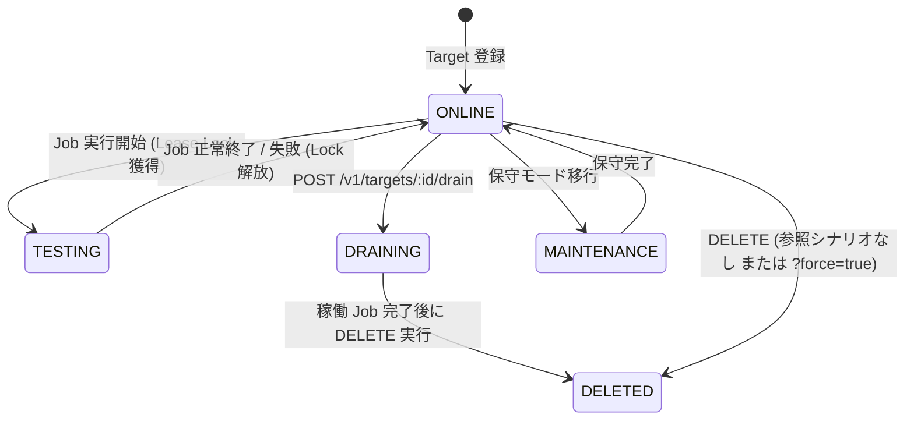

# Musubi 運用・開発・保守メンテナンスガイド (Maintainer & Bug-Fixing Guide)

本書は、**Musubi (SNMP Network Scenario Orchestration Platform)** の内部設計、アーキテクチャ境界、並行制御モデル、開発・テスト手順、およびバグ修正時の留意事項・落とし穴（Pitfalls）を包括的にまとめたメンテナー向けドキュメントです。

---

## 1. システム概要とアーキテクチャ設計

Musubi は、ネットワーク機器（ルータ・スイッチ等）に対する SNMP 操作（Get / Set / BulkGet）および Trap/Inform 受信をトリガーとする**シナリオ駆動型オーケストレーション基盤**です。

```
                          +------------------------------------------+
                          |             Grafana UI / API             |
                          +------------------------------------------+
                                               |
                                               v
                          +------------------------------------------+
                          |           Gateway (REST & SSE)           |
                          |  - RFC 7807 Problem Details Error Model  |
                          |  - Prometheus Metrics (/metrics)         |
                          +------------------------------------------+
                               /              |             \
                              v               v              v
      +----------------------------+  +---------------+  +---------------------+
      |   Orchestrator (Engine)    |  | State (CEL)   |  |   Collector (SNMP)  |
      | - Scenario DSL & Runner    |  | - 2-Tier Repo |  | - UDP Trap Listener |
      | - Lease Lock Lifecycle Mgr |  | - Google CEL  |  | - GoSNMP Client     |
      +----------------------------+  +---------------+  +---------------------+
                     \                        |                       /
                      +-----------------------v----------------------+
                      |      Notification Hub & Telemetry Metrics    |
                      +----------------------------------------------+
                                              |
                                              v
                                   [ PostgreSQL / Ent ORM ]
```

### 1.1 4つのコア・バウンデッドコンテキスト

| コンテキスト | パッケージ | 主な役割 |
|---|---|---|
| **Collector** | `internal/collector` | SNMP v1/v2c/v3 クライアント (Get/Set/BulkGet)、UDP ポート (162/1162) での Trap/Inform 受信とデコード。 |
| **State** | `internal/state` | 2-Tier（Raw OID レイヤ / 導出 Derived 変数レイヤ）インメモリ状態管理、Google CEL 式評価エンジン、状態遷移ログ生成。 |
| **Orchestrator** | `internal/orchestrator` | シナリオ DSL (YAML) パーサー、機器リースロック管理、ステップ実行 (Action/Wait-until/Teardown)、孤立シナリオ検知。 |
| **Gateway** | `internal/gateway` | REST API (Gin)、RFC 7807 エラーハンドラ、SSE (Server-Sent Events) / Long Polling 配信、Prometheus メトリクス公開。 |
| **Common** | `internal/common/*` | ライフサイクルリースロック (`lifecycle`)、非同期バッチャ (`batcher`)、PubSub ハブ (`notification`)、共通型 (`types`)、エラー定義 (`errors`)。 |

---

## 2. コアライフサイクル & 並行制御モデル

### 2.1 ターゲット・シナリオ・ジョブのライフサイクル状態遷移



### 2.2 ライフサイクル 14 パターン検証マトリクス (C-01 〜 C-14)

Musubi は、GitOps 運用や意図しない削除競合を防ぐため、以下の 14 パターンの不変条件（Invariants）を保証しています（`internal/orchestrator/lifecycle_permutation_test.go` にて常時自動検証）：

| ID | シナリオ・ターゲット操作 | 期待される動作 |
|---|---|---|
| **C-01** | GitOps シナリオ先行登録 $\rightarrow$ 後からターゲット登録 $\rightarrow$ ジョブ実行 | **成功 (202 Accepted)**：事前登録されたターゲットが ONLINE になれば即座に実行可能。 |
| **C-02** | シナリオ登録 $\rightarrow$ ターゲット未登録状態でジョブ実行 | **事前拒否 (422 Pre-flight Failed)**：`TARGET_NOT_FOUND` エラーで即座にブロック。 |
| **C-03** | 標準フロー (ターゲット登録 $\rightarrow$ シナリオ登録 $\rightarrow$ ジョブ実行) | **成功 (202 Accepted $\rightarrow$ 200 SUCCESS)**。 |
| **C-04** | シナリオから参照中のターゲットを通常削除 | **保護拒否 (400 Bad Request)**：参照中シナリオ ID リストを返し削除を拒絶。 |
| **C-05** | `?force=true` で削除されたターゲットへのジョブ実行 | **事前拒否 (422 Target Deleted)**：削除済みターゲットへのロック獲得を阻止。 |
| **C-06** | ターゲット強制削除後の孤立シナリオ検知 | **検知・隔離**：`/v1/scenarios/orphans` で孤立シナリオを検出、`/v1/scenarios/cleanups` で一括クリーンアップ。 |
| **C-07** | `?cleanup_scenarios=true` 付きでのターゲット削除 | **カスケード削除**：依存するシナリオも同時にクリーンアップ。 |
| **C-08** | ジョブ実行中 (TESTING) ターゲットの通常削除 | **競合拒否 (409 Conflict)**：実行中ジョブがあるターゲットは削除不可。 |
| **C-09** | ジョブ実行中のターゲット設定変更（IP/Port等） | **イミュータブル分離**：実行中ジョブは開始時のスナップショット設定で完走。 |
| **C-10** | ジョブ実行中のシナリオ DSL バージョン更新 (v1 $\rightarrow$ v2) | **バージョン分離**：実行中ジョブは v1 の DSL 定義で最後まで動作。 |
| **C-11** | ジョブ実行中のシナリオ削除 | **保護拒否 (409 Conflict)**：`?force_abort=true` がない限り削除拒絶。 |
| **C-12** | 同一ターゲットに対する 2 つのシナリオ同時実行 | **排他リースロック (409 Conflict / 422)**：ロック競合を防止し片方を安全に拒否。 |
| **C-13** | MAINTENANCE モードターゲットへのジョブ実行 | **事前拒否 (422 Target in Maintenance)**。 |
| **C-14** | 削除済みシナリオの実行要求 | **404 Not Found**。 |

---

## 3. ドメイン・エラー設計 (RFC 7807 Problem Details)

API エラーはすべて **RFC 7807 (Problem Details for HTTP APIs)** に準拠しています。

```json
{
  "type": "https://musubi.io/errors/TARGET_REFERENCED",
  "title": "Bad Request",
  "status": 400,
  "detail": "Target 'spine1' is referenced by active scenarios.",
  "instance": "/v1/targets/spine1",
  "code": "TARGET_REFERENCED",
  "actionable_guidance": {
    "suggestion": "Remove referencing scenarios or pass ?force=true or ?cleanup_scenarios=true.",
    "doc_url": "https://musubi.io/docs/errors#TARGET_REFERENCED"
  },
  "invalid_params": null
}
```

---

## 4. メンテナー向けバグ修正・開発時の留意事項 (Critical Pitfalls)

### 4.1 並行処理とミューテックスのデッドロック防止
- **ロック順序の厳守**:
  - `LifecycleManager.mu` と `StateRepository.mu` を跨ぐ処理を行う際は、必ず **`LifecycleManager` $\rightarrow$ `StateRepository`** の順序でロックを取得してください。逆順での取得はデッドロックを引き起こします。
- **コールバック内でのロック取得禁止**:
  - `StateRepository.onTransition` や `NotificationHub` のリスナー関数内では、同期的な外部ミューテックスの取得を避け、チャンネル送信または非同期 goroutine で処理してください。

### 4.2 ゴルーチンリーク（Goroutine Leaks）の防止
- **Context Cancellation**:
  - すべての非同期タスク（SNMP リスナー、Wait Polling、SSE ストリーム等）は `ctx.Done()` または `context.WithCancel` を受け取り、確実に終了（Return）するように実装してください。
- **テスト時のリーク検証**:
  - 単体テストには必ず `defer goleak.VerifyNone(t)` を含め、終了していないゴルーチンが残っていないことを検証してください。

### 4.3 UDP / SNMP 通信の特性と GoSNMP の注意点
- **GoSNMP の TrapListener 競合回避**:
  - `gosnmp.TrapListener.Listen()` と `Close()` はサードパーティ内部でデータ競合を起こしやすいため、Musubi では標準の `net.ListenUDP` と `conn.SetReadDeadline` によるノンブロッキングループを採用しています。変更時は `listener.go` の設計を維持してください。
- **SNMP v3 認証パラメータ**:
  - `AuthProtocol` (MD5/SHA/SHA224/SHA256/SHA384/SHA512) および `PrivProtocol` (DES/AES/AES192/AES256) の大文字小文字パースには `strings.ToUpper` を使用してください。

### 4.4 クロスプラットフォーム対応（Windows / Linux / macOS）
- **プロセスメトリクス取得**:
  - Musubi のサーバー CPU・メモリメトリクスは、外部の `node_exporter` を必要とせず、Prometheus Go クライアントのネイティブ機能 (`client_golang`) を使用しています。
  - Windows 環境では Win32 API (`GetProcessTimes`, `GetProcessMemoryInfo`)、Linux 環境では `/proc/self/stat` がランタイムにより透過的に呼び出されるため、OS 固有のパスハードコード（`/proc` 等）は絶対に行わないでください。
- **クロスコンパイルの検証**:
  - コード修正後は、必ず `GOOS=windows GOARCH=amd64 go build ./cmd/...` がエラーなく通ることを確認してください。

### 4.5 データベース・ORM (Ent) 操作
- **スキーマ変更時の手順**:
  1. `ent/schema/*.go` を編集。
  2. `go generate ./ent` を実行して ORM コードを再生成。
  3. `database.NewClient` を通じた自動マイグレーション (`client.Schema.Create`) の動作をテスト。
- **SQLite テストと PostgreSQL 本番の互換性**:
  - 単体テストではインメモリ SQLite (`file:test?mode=memory&cache=shared&_pragma=foreign_keys(1)`)、E2E/本番環境では PostgreSQL を使用します。
  - RDBMS 依存の生 SQL を書かず、Ent の型安全クエリビルダを使用してください。

---

## 5. 開発・テスト・検証コマンド集

### 5.1 ローカル開発コマンド
```bash
# 全バイナリのビルド (musubi-server, musubi-cli, mock-snmp-agent)
make build

# Windows向けクロスコンパイル検証
GOOS=windows GOARCH=amd64 go build ./cmd/...

# 全パッケージの単体テスト実行 (-race & goleak 検証付き)
make test

# カバレッジ基準 (80%以上) の測定とレポート出力
bash scripts/check_coverage.sh
```

### 5.2 Docker Compose & E2E / Grafana 検証
```bash
# PostgreSQL, Prometheus, Grafana, Mock Agent を含むフルスタック起動
docker compose -f deploy/docker-compose.yml up -d --build

# 起動確認 (API Healthz)
curl http://localhost:8080/v1/system/healthz

# Grafana ダッシュボード表示確認
open http://localhost:3000   # (admin / admin)
```

---

## 6. ディレクトリ・ソースコード構成

```
Musubi/
├── api/
│   └── openapi.yaml                 # OpenAPI 3.0 API 定義仕様書
├── cmd/
│   ├── musubi-server/               # Musubi メインサーバー起動エントリポイント
│   ├── musubi-cli/                  # 管理用 CLI ツール
│   └── mock-snmp-agent/             # SNMP 擬似エージェント (テスト・デモ用)
├── deploy/
│   ├── docker-compose.yml           # E2E・デモ用 Docker Compose 定義
│   ├── prometheus/                  # Prometheus 収集設定 (scrape_configs)
│   └── grafana/
│       ├── dashboards/
│       │   └── musubi_overview.json # CPU/メモリ/帯域/MIBテーブル監視ダッシュボード
│       └── provisioning/            # ダッシュボード・データソース自動プロビジョニング
├── docs/
│   ├── architecture.md              # 詳細アーキテクチャ設計書
│   └── maintenance_guide.md         # 本保守・開発・バグ修正ガイド
├── ent/                             # Ent ORM 自動生成コード & スキーマ定義
│   └── schema/                      # Target, Scenario, Job, Credential 等のスキーマ
├── internal/
│   ├── collector/                   # SNMP クライアント & UDP Trap リスナー
│   ├── common/                      # 共通モジュール (バッチャ, リースロック, ハブ, メトリクス, エラー)
│   ├── database/                    # Ent クライアント初期化 & マイグレーション
│   ├── gateway/                     # REST API ルーター, ハンドラ, RFC 7807 変換
│   ├── orchestrator/                # シナリオ DSL 実行エンジン & 孤立シナリオ検知
│   ├── state/                       # 2-Tier 状態リポジトリ & Google CEL 評価器
│   └── testutil/snmpmock/           # テスト用 SNMP モックエージェント
└── scripts/
    └── check_coverage.sh            # カバレッジ自動検証スクリプト (>= 80%)
```
