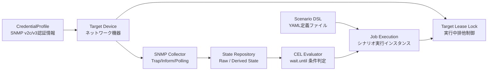

# Musubi ユーザー利用マニュアル (User Manual & Operations Guide)

**SNMP Scenario Orchestrator (Musubi)** は、複数の SNMP Agent（ネットワーク機器）に対してシナリオベースで自動試験・状態監視・イベント駆動制御を実行する OSS ネットワーク試験・運用自動化基盤です。

本ドキュメントは、Musubi を初めて導入するエンジニアから、日常的にシナリオ作成・実行・システム運用を行うオペレーターまでを対象とした総合利用マニュアルです。

---

## 📑 目次

1. [Musubi の概要と基本コンセプト](#1-musubi-の概要と基本コンセプト)
2. [クイックスタート & 環境構築](#2-クイックスタート--環境構築)
3. [認証プロファイルとターゲット機器の管理](#3-認証プロファイルとターゲット機器の管理)
4. [シナリオ作成パーフェクトガイド (DSL & CEL 仕様)](#4-シナリオ作成パーフェクトガイド-dsl--cel-仕様)
5. [シナリオの登録・実行・進捗監視・オンデマンド実行](#5-シナリオの登録実行進捗監視オンデマンド実行)
   - 5.1 [シナリオの登録 (Import)](#51-シナリオの登録-import)
   - 5.2 [シナリオの実行 (Run Job)](#52-シナリオの実行-run-job)
   - 5.3 [ジョブの進捗確認・ログ取得・強制キャンセル](#53-ジョブの進捗確認ログ取得強制キャンセル)
   - 5.4 [SSE によるリアルタイムストリーム購読](#54-sse-server-sent-events-によるリアルタイムストリーム購読)
   - 5.5 [オンデマンド・ワンショット シナリオ直接実行 (Ad-hoc Execution)](#55-オンデマンドワンショット-シナリオ直接実行-ad-hoc-execution)
6. [Grafana ダッシュボードによるリアルタイム監視](#6-grafana-ダッシュボードによるリアルタイム監視)
7. [運用・保守・ライフサイクル管理](#7-運用保守ライフサイクル管理)
8. [トラブルシューティング & FAQ](#8-トラブルシューティング--faq)
9. [ユーザー体験 (UX/DX) 向上のためのベストプラクティス](#9-ユーザー体験-uxdx-向上のためのベストプラクティス)

---

## 1. Musubi の概要と基本コンセプト

### 1.1 Musubi が解決する課題
* **エアギャップ環境での自律試験**: インターネット接続のないセキュアな検証ラボ環境でも、外部依存ゼロ（単一バイナリ / Docker コンテナ）で完結動作します。
* **Trap/Inform 連動のリアルタイム検証**: 定期ポーリング待ちのタイムラグを排除し、機器から送信される SNMP Trap / Inform をミリ秒単位で検知してシナリオを即座に進捗させます。
* **CEL (Common Expression Language) による宣言的状態評価**: 複雑なスクリプトを書くことなく、`raw['spine1']['IF-MIB::ifOperStatus.1'] == 'up'` のような宣言的な式で合否判定が可能です。
* **排他ロックとライフサイクル保護**: 複数エンジニアや並行テストによるターゲット機器の競合を Lease Lock（リースロック）で防ぎ、設定変更中の機器破壊や誤操作を未然に防止します。

### 1.2 主要コンセプト用語集



| 用語 | 説明 |
| :--- | :--- |
| **Target (ターゲット)** | 試験・監視対象となるネットワーク機器（ルータ、スイッチ、ファイアウォール、サーバー等）。ホスト名/IP、ポート、状態を保持します。 |
| **CredentialProfile (認証プロファイル)** | SNMP v1, v2c (Community), v3 (USM: MD5/SHA/SHA256, DES/AES) の接続クレデンシャル定義。複数のターゲットで共有可能。 |
| **Scenario DSL (シナリオDSL)** | 試験手順を YAML で記述した定義体。実行に必要なターゲットロック、入力パラメータ、ステップ手順、Teardown を定義します。 |
| **Job (ジョブ)** | シナリオを実行した際の実行単位（インスタンス）。実行ステータス（`QUEUED`, `RUNNING`, `SUCCESS`, `FAILED`, `ABORTED`）や各ステップの結果を記録します。 |
| **State Repository (状態リポジトリ)** | 機器から収集された最新の SNMP 状態（`Raw State`）や、複数状態を集約した派生状態（`Derived State`）をメモリ上でインデックス管理するストア。 |
| **CEL (Common Expression Language)** | Google が開発した高速・安全な式評価言語。シナリオの `wait.until` 条件判定に採用されています。 |
| **Notification Hub** | 状態変化やジョブ進捗イベントを SSE (Server-Sent Events) や Long-Polling でリアルタイム配信するPubSubエンジン。 |

---

## 2. クイックスタート & 環境構築

### 2.1 前提条件
* **Docker & Docker Compose** (推奨環境: Docker 24.0+, Docker Compose v2.20+)
* または **Go 1.22+** (ローカルバイナリとしてビルド・実行する場合)

---

### 2.2 Docker Compose による即時起動 (推奨)

リポジトリルートで以下のコマンドを実行するだけで、Musubi Server、Mock SNMP Agent、VictoriaMetrics (TSDB)、Grafana が自動構成されて起動します。

```bash
# コンテナのビルドおよびバックグラウンド起動
docker compose up -d --build
```

#### 起動サービスのポート一覧

| サービス名 | ポート | プロトコル | 用途 |
| :--- | :--- | :--- | :--- |
| **musubi-server** | `8080` | HTTP | Musubi REST API, SSE ストリーム, `/metrics` エンドポイント |
| **musubi-server** | `162` | UDP | SNMP Trap / Inform 受信リスナー (ポートマッピング: `162:162/udp`) |
| **mock-snmp-agent** | `161` | UDP | 純Go 実装のテスト用 SNMP Mock エージェント |
| **victoriametrics** | `8428` | HTTP | 高性能 TSDB（Prometheus 互換メトリクス収集・保存） |
| **grafana** | `3000` | HTTP | リアルタイム可視化ダッシュボード (`http://localhost:3000`) |
| **postgres** | `5432` | TCP | リレーショナル永続化ストレージ (`musubi/musubi_secret`) |

```bash
# 健全性確認 (Health Check)
curl -s http://localhost:8080/v1/system/healths | jq .
```

---

### 2.3 ローカルバイナリでのビルド & 起動

コンテナを使わず、開発端末やオンプレミスサーバーのホストOS上で直接起動する場合の手順です。

```bash
# 1. 全バイナリの一括コンパイル (bin/ に生成されます)
make build

# 2. Musubi サーバーの起動 (デフォルト: SQLite インメモリ / ローカルDB)
./bin/musubi-server

# 別ターミナルで Mock SNMP Agent を起動 (必要に応じて)
./bin/mock-snmp-agent
```

---

## 3. 認証プロファイルとターゲット機器の管理

### 3.1 認証プロファイル (CredentialProfile) の作成

ターゲット機器へ接続するための SNMP 認証情報を登録します。

#### CLI による作成
```bash
# SNMP v3 (AuthPriv) 認証プロファイルの作成
./bin/musubi-cli credentials create \
  --name "v3-core-admin" \
  --version "v3" \
  --sec-level "authPriv" \
  --username "snmpadmin" \
  --auth-proto "SHA256" \
  --auth-pass "AuthPassword123!" \
  --priv-proto "AES" \
  --priv-pass "PrivPassword123!"

# SNMP v2c (Community) 認証プロファイルの作成
./bin/musubi-cli credentials create \
  --name "v2c-public" \
  --version "v2c" \
  --community "public"
```

#### REST API による作成
```bash
curl -X POST http://localhost:8080/v1/credentials \
  -H "Content-Type: application/json" \
  -d '{
    "name": "v3-core-admin",
    "version": "v3",
    "sec_level": "authPriv",
    "username": "snmpadmin",
    "auth_protocol": "SHA256",
    "auth_passphrase": "AuthPassword123!",
    "priv_protocol": "AES",
    "priv_passphrase": "PrivPassword123!"
  }'
```

---

### 3.2 ターゲット機器 (Target) の登録

```bash
# CLI によるターゲット登録
./bin/musubi-cli targets create \
  --name "spine1" \
  --host "192.168.10.1" \
  --port 161 \
  --credential "v3-core-admin" \
  --labels "role=spine,site=dc1,model=switch-x"

# 疎通確認 (SNMP Ping)
./bin/musubi-cli targets ping --name "spine1"
```

#### REST API によるターゲット登録
```bash
curl -X POST http://localhost:8080/v1/targets \
  -H "Content-Type: application/json" \
  -d '{
    "name": "spine1",
    "description": "DC1 Core Spine Switch 1",
    "host": "192.168.10.1",
    "port": 161,
    "credential_id": "cred-v3-core-admin",
    "labels": {
      "role": "spine",
      "site": "dc1"
    }
  }'
```

---

### 3.3 ターゲット機器のステータスとドレイン (Drain)

ターゲット機器には以下のステータスが存在します：

```
 ONLINE ──(Drain API)──> DRAINING ──(全Job完了)──> OFFLINE / DELETED
    │
    └──(Maintenance API)──> MAINTENANCE (試験停止・ロック拒否)
```

1. **ONLINE**: 通常稼働状態。新規ジョブのロック獲得およびシナリオ実行が可能。
2. **DRAINING (ドレイン)**: 計画メンテナンス用。**実行中のジョブ完了を待ちつつ、新規ジョブのロック獲得をブロック**します。
   ```bash
   # CLI でドレインを開始
   ./bin/musubi-cli targets drain --name "spine1"
   ```
3. **MAINTENANCE**: メンテナンス中。事前検証 (Pre-flight) で直ちに `422 Unprocessable Entity` として拒否されます。
4. **OFFLINE / DELETED**: 停止または削除済み。

---

## 4. シナリオ作成パーフェクトガイド (DSL & CEL 仕様)

Musubi では、試験手順をシンプルかつ可読性の高い **YAML DSL** で記述します。

### 4.1 シナリオ YAML の基本構造

```yaml
# ==============================================================================
# シナリオ基本情報
# ==============================================================================
name: "spine-linkdown-failover-test"
description: "Spine1のインターフェース切断によるBGPフェイルオーバー検証"
version: 1

# ==============================================================================
# ターゲット排他ロック (必須)
# シナリオ開始時に排他リースロックを獲得し、終了時に自動解放します。
# ==============================================================================
target_locks:
  - "spine1"
  - "spine2"

# ==============================================================================
# 動的入力パラメータ定義 (CLIやAPIから実行時に上書き可能)
# ==============================================================================
inputs:
  target_interface:
    type: "string"
    description: "試験対象のインターフェースOIDインデックス"
    default: "1"
    required: true
  wait_timeout:
    type: "string"
    description: "状態収束待ちの最大タイムアウト時間"
    default: "10s"

# ==============================================================================
# メイン試験ステップ (上から順に実行)
# ==============================================================================
steps:
  # ステップ1: 初期状態の確認 (リンクが UP であること)
  - id: "step1_verify_initial_link_up"
    name: "初期リンク稼働状態の確認"
    target: "spine1"
    wait:
      until: "raw['spine1']['IF-MIB::ifOperStatus.' + inputs.target_interface] == 'up' || raw['spine1']['1.3.6.1.2.1.2.2.1.8.' + inputs.target_interface] == 1"
      timeout: "${inputs.wait_timeout}"
      interval: "200ms"

  # ステップ2: SNMP SET による意図的なリンクダウン発生 (障害注入)
  - id: "step2_inject_link_down"
    name: "Spine1 インターフェースの意図的ダウン (ifAdminStatus=down)"
    target: "spine1"
    action: "action.snmp_set"
    params:
      oid: "1.3.6.1.2.1.2.2.1.7.${inputs.target_interface}"  # IF-MIB::ifAdminStatus
      type: "int"
      value: 2                                               # 2 = down
    ignore_error: false

  # (オプション) ステップ2.5: SNMP Bulk-Get によるインターフェースMIB一括取得
  # - id: "step2_5_bulk_get_interfaces"
  #   name: "IF-MIB テーブルの一括取得"
  #   target: "spine1"
  #   action: "action.snmp_bulk_get"
  #   params:
  #     oid: "1.3.6.1.2.1.2.2.1"
  #     non_repeaters: 0
  #     max_repetitions: 10

  # ステップ3: Trap または Polling によるリンクダウンの検知待ち
  - id: "step3_wait_for_oper_status_down"
    name: "リンクダウン検知の確認"
    target: "spine1"
    wait:
      until: "raw['spine1']['IF-MIB::ifOperStatus.' + inputs.target_interface] == 'down' || raw['spine1']['1.3.6.1.2.1.2.2.1.8.' + inputs.target_interface] == 2"
      timeout: "5s"
      interval: "100ms"

  # ステップ4: 対向機 (Spine2) への経路切り替え確認
  - id: "step4_verify_failover_route"
    name: "Spine2 のアクティブ経路昇格確認"
    target: "spine2"
    wait:
      until: "derived['cluster.primary_spine'] == 'spine2'"
      timeout: "10s"
      interval: "500ms"

# ==============================================================================
# クリーンアップ / ロールバック手順 (Teardown)
# stepsが途中で失敗またはタイムアウトした場合でも、必ず最後に実行されます。
# ==============================================================================
teardown:
  - id: "teardown_restore_link"
    name: "Spine1 インターフェースの復旧 (ifAdminStatus=up)"
    target: "spine1"
    action: "action.snmp_set"
    params:
      oid: "1.3.6.1.2.1.2.2.1.7.${inputs.target_interface}"
      type: "int"
      value: 1                                               # 1 = up
    ignore_error: true
```

---

### 4.2 CEL (Common Expression Language) 式リファレンス

`wait.until` 条件式では、高速かつ型安全な Google CEL 式を使用します。

#### 使用可能な組み込みスコープ

| スコープ | 説明 | 記法例 |
| :--- | :--- | :--- |
| `raw['<target>']['<oid_or_name>']` | 指定ターゲットの最新 SNMP 取得値（Trap/Inform/Get で随時更新） | `raw['spine1']['IF-MIB::ifOperStatus.1'] == 'up'` |
| `derived['<key>']` | システム内で集約・計算された派生ステータス | `derived['cluster.health'] == 'HEALTHY'` |
| `inputs['<key>']` または `inputs.<key>` | シナリオ実行時に渡された動的入力値 | `raw['spine1']['status'] == inputs.expected_val` |

#### よく使う CEL 演算子・関数一覧

```javascript
// 1. 等値・比較演算
raw['spine1']['status'] == 1
raw['spine1']['cpu_usage'] < 80.0
raw['spine1']['bgp_peer_count'] >= inputs.min_peers

// 2. 論理演算 (AND / OR / NOT)
(raw['spine1']['link1'] == 'up') && (raw['spine2']['link1'] == 'up')
raw['spine1']['oper'] == 'down' || raw['spine1']['admin'] == 'down'
! (raw['spine1']['is_rebooting'] == true)

// 3. 文字列操作・正規表現
raw['spine1']['sysDescr'].contains("RouterOS")
raw['spine1']['hostname'].startsWith("tokyo-core-")
raw['spine1']['version'].matches("^v[0-9]+\\.[0-9]+")

// 4. コレクション・リスト判定
raw['spine1']['active_vlan'] in [10, 20, 30]
```

---

### 4.3 実務シナリオテンプレート集

#### テンプレート 1: BGP ピア状態監視 & ルート収束テスト
```yaml
name: "bgp-neighbor-established-check"
description: "BGPピアがESTABLISHED状態(6)になり、経路数が規定値を超えることを検証"
target_locks: ["leaf1"]
inputs:
  peer_ip:
    type: "string"
    default: "192.168.100.1"
steps:
  - id: "check_bgp_state"
    target: "leaf1"
    wait:
      # 6 = Established (BGP4-MIB::bgpPeerState)
      until: "raw['leaf1']['1.3.6.1.2.1.15.3.1.2.' + inputs.peer_ip] == 6"
      timeout: "30s"
      interval: "1s"
```

#### テンプレート 2: CPU・メモリ高負荷アラート検知テスト
```yaml
name: "cpu-load-threshold-check"
description: "CPU使用率が閾値以下に安定していることを確認"
target_locks: ["spine1"]
steps:
  - id: "check_cpu_utilization"
    target: "spine1"
    wait:
      until: "raw['spine1']['HOST-RESOURCES-MIB::hrProcessorLoad.1'] < 75"
      timeout: "15s"
      interval: "1s"
```

---

## 5. シナリオの登録・実行・進捗監視

### 5.1 シナリオの登録 (Import)

作成した YAML ファイルを Musubi サーバーに登録します。

```bash
# CLI によるシナリオ登録 (初回登録または更新)
./bin/musubi-cli scenarios import --file ./scenarios/linkdown.yaml
```

```bash
# REST API によるシナリオ登録
curl -X POST http://localhost:8080/v1/scenarios \
  -H "Content-Type: application/json" \
  -d '{
    "name": "spine-linkdown-failover-test",
    "description": "Spine1 Linkdown test",
    "dsl_yaml": "'"$(cat ./scenarios/linkdown.yaml | sed 's/"/\\"/g' | awk '{printf "%s\\n", $0}')"'"
  }'
```

---

### 5.2 シナリオの実行 (Run Job)

```bash
# CLI で実行を開始
./bin/musubi-cli scenarios run --name "spine-linkdown-failover-test"
```

#### パラメータを指定して REST API で実行
```bash
curl -X POST http://localhost:8080/v1/scenarios/spine-linkdown-failover-test/runs \
  -H "Content-Type: application/json" \
  -d '{
    "inputs": {
      "target_interface": "2",
      "wait_timeout": "15s"
    }
  }'
```
**レスポンス例 (`202 Accepted`):**
```json
{
  "job_id": "job-7b9a2c-174839201",
  "status": "QUEUED",
  "scenario_name": "spine-linkdown-failover-test",
  "scenario_version": 1,
  "created_at": "2026-08-22T14:30:00Z"
}
```

---

### 5.3 ジョブの進捗確認・ログ取得・強制キャンセル

```bash
# ジョブの詳細ステータス確認
./bin/musubi-cli jobs status --id "job-7b9a2c-174839201"

# ジョブのステップ実行ログの取得
./bin/musubi-cli jobs logs --id "job-7b9a2c-174839201"

# 実行中ジョブの安全な強制キャンセル (Teardownが自動実行されます)
./bin/musubi-cli jobs cancel --id "job-7b9a2c-174839201"
```

---

### 5.4 SSE (Server-Sent Events) によるリアルタイムストリーム購読

フロントエンドや CI/CD スクリプトから、状態変化やステップ進捗をリアルタイム購読できます。

```bash
# SSE ストリームの受信
curl -N http://localhost:8080/v1/events/stream
```

**受信イベント例:**
```json
data: {"id":"evt-101","topic":"job.step_advanced","payload":{"job_id":"job-1","step_id":"step1_verify_initial_link_up","status":"SUCCESS"},"timestamp":"2026-08-22T14:30:02Z"}

data: {"id":"evt-102","topic":"state.transition","payload":{"target":"spine1","state_key":"IF-MIB::ifOperStatus.1","old_value":"up","new_value":"down","trigger":"TRAP"},"timestamp":"2026-08-22T14:30:05Z"}
```

---

### 5.5 オンデマンド・ワンショット シナリオ直接実行 (Ad-hoc Execution)

日常の運用や一時的な疎通確認、CI/CD からのパトロール実行など、**「繰り返されない1回限りのテスト」** において、事前にシナリオカタログへ登録することなく、1度の API 呼び出しでインラインの YAML 定義を即時実行できます。

#### 💡 特徴・メリット
1. **カタログ汚染ゼロ**: `GET /v1/scenarios` の一覧にテンポラリな使い捨てシナリオが登録・蓄積されません。
2. **完全なログ・証跡記録**:
   - **Job 履歴 (`Job`)**: 実行ステータス、入出力、開始/終了時刻、所要時間をDBに完全保存。
   - **状態遷移ログ (`StateTransitionLog`)**: SNMP Get, BulkGet, Set および Inform-Request による MIB 値変化をリアルタイム保存（Grafana で検索可能）。
   - **監査ログ (`AuditLog`)**: 実行者、IP、対象機器、DSL構造の証跡を自動記録。
   - **メトリクス**: Prometheus / VictoriaMetrics にジョブ実行メトリクスを自動反映。
3. **同期 (`wait=true`) / 非同期 (`wait=false`) の両対応**:
   - CLI スクリプトや curl で即座に成否・所要時間を受け取りたい場合は同期モード、長時間シナリオには非同期モードを選択可能。

#### REST API エンドポイント
* **パス**: `POST /v1/scenarios/adhoc`
* **認証**: Bearer JWT

#### 実行例 1: 同期実行 (ワンショットで即座に結果を取得)
`"wait": true` を指定すると、全ステップの実行完了（または失敗）まで HTTP 接続を維持し、結果ステータスを即座に返却します。

```bash
curl -X POST http://localhost:8080/v1/scenarios/adhoc \
  -H "Content-Type: application/json" \
  -d '{
    "name": "adhoc-8step-linkdown-recovery",
    "wait": true,
    "inputs": {
      "target": "spine1"
    },
    "dsl_yaml": "'"$(cat examples/scenarios/adhoc_8step_linkdown_recovery.yaml | sed 's/"/\\"/g' | awk '{printf "%s\\n", $0}')"'"
  }'
```

**同期レスポンス例 (`200 OK`):**
```json
{
  "job_id": "job-adhoc-1757112000000000",
  "scenario_id": "adhoc-8step-linkdown-recovery",
  "status": "SUCCESS",
  "duration_ms": 135,
  "locked_targets": ["spine1"],
  "stream_url": "/v1/events/streams?topics=job.step_advanced&job_id=job-adhoc-1757112000000000"
}
```

#### 実行例 2: 非同期実行 (長時間ジョブ・進捗ストリーミング)
`"wait": false`（デフォルト）の場合、即座に `202 Accepted` が返却され、SSE ストリームで進捗をリアルタイム追跡できます。

```bash
curl -X POST http://localhost:8080/v1/scenarios/adhoc \
  -H "Content-Type: application/json" \
  -d '{
    "name": "adhoc-spine-check",
    "wait": false,
    "dsl_yaml": "'"$(cat examples/scenarios/adhoc_8step_linkdown_recovery.yaml | sed 's/"/\\"/g' | awk '{printf "%s\\n", $0}')"'"
  }'
```

**非同期レスポンス例 (`202 Accepted`):**
```json
{
  "job_id": "job-adhoc-1757112000000001",
  "scenario_id": "adhoc-spine-check",
  "status": "RUNNING",
  "locked_targets": ["spine1"],
  "stream_url": "/v1/events/streams?topics=job.step_advanced&job_id=job-adhoc-1757112000000001"
}
```

#### サンプルシナリオ解説 (`examples/scenarios/adhoc_8step_linkdown_recovery.yaml`)
本機能向けに、**8 リクエスト以上（計10リクエスト）** かつ **SNMP Inform-Request 受信待ち** を含む実戦的なリンク障害・復旧テストサンプルを用意しています：
- **Step 1-3**: システム情報（`sysDescr`, `sysName`）およびポート1の初期ステータス（`ifAdminStatus.1`, `ifOperStatus.1`）取得 (Get 3回)
- **Step 4-5**: 全インターフェースカウンタおよびポート2の状態一括取得 (BulkGet 2回)
- **Step 6**: ポート1の強制ダウン注入 (`action.snmp_set`, `ifAdminStatus.1 = 2`) (Set 1回)
- **Step 7**: **エージェントからの SNMP Inform-Request（`ifOperStatus.1 == 2`）を待機**（Musubi が自動で RFC 3416 準拠の Response-PDU ACK を返信）
- **Step 8**: ポート1のダウン確認 (Get 1回)
- **Step 9**: ポート1の管理者復旧 (`action.snmp_set`, `ifAdminStatus.1 = 1`) (Set 1回)
- **Step 10**: **エージェントからの SNMP Inform-Request（`ifOperStatus.1 == 1`）を待機**
- **Step 11-12**: 復旧確認および全インターフェースの最終検証 (Get 1回, BulkGet 1回)

---

## 6. Grafana ダッシュボードによるリアルタイム監視と対話型検索・絞り込み

Musubi は VictoriaMetrics (TSDB) および PostgreSQL と連携した公式 Grafana ダッシュボード (`deploy/grafana/dashboards/musubi_overview.json`) を標準提供しています。

* **アクセス URL**: `http://localhost:3000/d/musubi-overview`
* **認証**: 認証なし (Anonymous 閲覧可能) または `admin / admin`


### 6.1 ダッシュボード上部の対話型フィルター (ユーザー指定)
Grafana ダッシュボード上部には、リアルタイムに対象ログを絞り込むための対話型コントロールが配置されています：

| フィルター変数 | 種別 | 説明・使用例 |
| :--- | :--- | :--- |
| **`Target Device` (`$target`)** | ドロップダウン | `All` または登録済みターゲット名（`spine1`, `spine2` 等）を選択して対象機器を即座に絞り込み。 |
| **`Trigger Source` (`$trigger`)** | ドロップダウン | データ取得元（`All`, `TRAP`, `INFORM`, `BULK_GET`, `POLLING`, `SET`, `API`）で絞り込み。 |
| **`Job Status` (`$status`)** | ドロップダウン | ジョブ実行結果（`All`, `SUCCESS`, `FAILED`, `RUNNING`, `QUEUED`, `ABORTED`）でシナリオ履歴を抽出。 |
| **`Search Filter` (`$search`)** | テキスト入力 | MIB名（例: `IF-MIB`）、OID（例: `ifOperStatus`）、シナリオ名、アクション名、ユーザー名を部分一致で検索。 |
| **時間範囲セレクター (Timepicker)** | 標準UI | 右上の時間範囲（「直近15分」「直近1時間」「昨日」「日時指定」等）を変更すると、`$__timeFilter` により指定期間のログのみを高速抽出。 |

### 6.2 大量レコード (2000+ 件) のスムーズな表示とページネーション
* **高速ページネーション**: テーブルパネルには 1 ページあたり 25 件のページネーションが有効化されており、2000 レコード以上の大量データが蓄積されてもブラウザの描画負荷なく快適に閲覧可能です。
* **テーブル内リアルタイム検索 & ソート**: テーブルヘッダーをクリックして任意の列で昇順/降順ソートが可能なほか、カラムごとの即時フィルタリングも利用できます。

### 6.3 提供パネル一覧
1. **リソース & 帯域監視**: CPU使用率、メモリ消費量、ネットワークスループット (Rx/Tx)。
2. **SNMP テレメトリ**: 受信 Trap/Inform レート、SNMP Request 処理レート、P95 レイテンシ。
3. **最新 MIB データキャッシュ (Panel 5)**: 時間範囲・機器・トリガー・フリーワードで絞り込み可能な MIB 遷移履歴。
4. **ターゲット台帳 & ステータス (Panel 6)**: 機器ステータス、ポート、認証プロファイル、最終ハートビート。
5. **シナリオ ジョブ実行履歴 (Panel 8)**: ジョブ成否、実行日時、トリガー元の推移。
6. **管理 & API 監査ログ (Panel 9)**: ユーザー操作、クライアント IP、実行アクションの証跡。

---

## 7. 運用・保守・ライフサイクル管理

### 7.1 ログリテンション運用 (In-Process Cleaner Worker & パージ)

Musubi は、OS 依存の Cron デーモン（crontab やタスクスケジューラ）を必要とせず、**サーバープロセス内蔵のクロスプラットフォーム Background Cleaner Worker** によってログのローテーション・パージを自律実行します。

#### 1. 環境変数による自動パージ設定
サーバー起動時（または `docker-compose.yml`）に以下の環境変数を設定するだけで、バックグラウンドワーカーが定期的に古い `state_transition_logs`、`jobs`、`audit_logs` を自動削除します：

```yaml
environment:
  - RETENTION_INTERVAL_HOURS=24   # パージ実行間隔 (デフォルト: 24時間毎)
  - RETENTION_DAYS=30             # ログ保存期間 (デフォルト: 30日、30日超過分をパージ)
```

#### 2. CLI によるオンデマンド手動パージ
メンテナンス時や容量逼迫時に、指定日数を超過したログを即座に削除できます：

```bash
# 30日以前のログを一括パージ
./bin/musubi-cli maintenance purge --days 30

# 7日以前のログをパージ
./bin/musubi-cli maintenance purge --days 7
```

#### 3. REST API によるパージ
外部の運用監視ツールや CI/CD から HTTP リクエストで実行可能です：

```bash
curl -X POST http://localhost:8080/v1/system/purge \
  -H "Content-Type: application/json" \
  -d '{"days": 30}'
```

#### 4. TSDB (VictoriaMetrics) および Docker ログのローテーション
* **VictoriaMetrics**: `docker-compose.yml` 内の起動コマンドに `-retentionPeriod=1` (1ヶ月) が設定されており、TSDB メトリクスも自動破棄されます。
* **Docker ログ**: `json-file` ドライバに `max-size: "10m"`, `max-file: "3"` が構成されており、コンテナ標準出力ログが無限に肥大化することはありません。

---

### 7.2 孤立シナリオ (Orphan Scenario) の検知と自動クリーンアップ

ターゲット機器を削除・退役させた際、削除されたターゲットを参照しているシナリオ（孤立シナリオ）を自動検知して安全に解消できます。

```bash
# 1. 孤立シナリオの一覧確認
curl -s http://localhost:8080/v1/scenarios/orphans | jq .

# 2. 孤立シナリオの一括クリーンアップ
curl -s -X POST http://localhost:8080/v1/scenarios/cleanups | jq .
```

---

### 7.3 ターゲット機器の安全な削除フロー

```bash
# ステップ 1: ドレインを開始し、新規ジョブの割り当てを停止
./bin/musubi-cli targets drain --name "spine1"

# ステップ 2: 稼働中ジョブの完了を確認後、ターゲットを削除
./bin/musubi-cli targets delete --name "spine1"

# ※ 強制削除する場合 (実行中ジョブを強制アボート + 参照シナリオも自動クリーンアップ)
curl -X DELETE "http://localhost:8080/v1/targets/spine1?force=true&force_abort=true&cleanup_scenarios=true"
```

---

### 7.4 システムバックアップ & リストア

全ターゲット、認証プロファイル、シナリオ、バージョン履歴を JSON 形式で瞬時にバックアップ・リストア可能です。

```bash
# バックアップの作成
curl -s -X POST http://localhost:8080/v1/system/backups > musubi_backup_$(date +%Y%m%d).json

# バックアップからのリストア
curl -s -X POST http://localhost:8080/v1/system/restores \
  -H "Content-Type: application/json" \
  -d @musubi_backup_20260822.json
```

---

## 8. トラブルシューティング & FAQ

### 8.1 一般的なエラーコードと解決策

| HTTP ステータス | エラーコード (`Code`) | 主な原因 | 解決策 |
| :--- | :--- | :--- | :--- |
| `404 Not Found` | `TARGET_NOT_FOUND` | シナリオで指定されたターゲットが未登録 | ターゲットを先に作成するか、シナリオの `target_locks` の名前を確認してください。 |
| `409 Conflict` | `TARGET_IN_USE` | 対象機器が別ジョブによりロック中 | 先行ジョブの完了を待つか、不要な場合は `musubi-cli jobs cancel` でキャンセルしてください。 |
| `409 Conflict` | `SCENARIO_IN_USE` | 実行中ジョブがあるシナリオを削除しようとした | ジョブ完了を待つか、`?force_abort=true` を指定して削除してください。 |
| `422 Unprocessable`| `TARGET_DRAINING` | ターゲットがドレイン状態 | メンテナンス完了後にターゲットのステータスを `ONLINE` に戻してください。 |
| `422 Unprocessable`| `TARGET_MAINTENANCE`| ターゲットがメンテナンスモード | メンテナンス完了後にステータスを更新してください。 |
| `400 Bad Request` | `INVALID_YAML` | シナリオ YAML の構文エラー | インデントや必須フィールド（`name`, `steps`）を確認してください。 |
| `400 Bad Request` | `INVALID_CEL` | `wait.until` CEL 式の文法不正 | 括弧の対応や OID 文字列のクォート表記を確認してください。 |

---

### 8.2 よくある質問 (FAQ)

**Q. SNMP v1 や v2c の機器でも動作しますか？**  
A. はい。CredentialProfile で `version: "v1"` または `version: "v2c"` を指定し、Community 名を設定するだけで利用可能です。

**Q. ターゲット機器が 100 台以上ある環境でもスケールしますか？**  
A. はい。Musubi は Non-blocking 内部 Batcher と効率的な UDP Trap リスナーを備えており、128 台以上のターゲットセットや数万 Trap/秒の環境でも安定して稼働する設計になっています。

**Q. シナリオの途中でエラーが発生した場合、設定変更は元に戻りますか？**  
A. はい。シナリオに `teardown` ブロックを記述しておくことで、途中のステップが失敗またはタイムアウトした場合でも必ずロールバック処理が実行されます。

---

## 9. ユーザー体験 (UX/DX) 向上のためのベストプラクティス

### 9.1 GitOps 連携による自動試験パイプライン
シナリオ YAML を Git リポジトリ（例: `network-scenarios/`）で管理し、GitHub Actions や GitLab CI から `musubi-cli` を呼び出すことで、ネットワーク変更時の自動リグレッションテストが実現できます。

```yaml
# GitHub Actions のワークフロージョブ例
- name: Run Musubi Scenario Test
  run: |
    ./bin/musubi-cli scenarios import --file ./scenarios/bgp_check.yaml
    ./bin/musubi-cli scenarios run --name "bgp-neighbor-established-check"
```

### 9.2 Mock Agent を活用したローカルシミュレーション
実機が手元にない場合でも、同梱の `./bin/mock-snmp-agent` を起動しておくことで、開発マシン上で即座に Trap 発行や SNMP GET/SET/BulkGet の結合テストを実施できます。

### 9.3 一連の SNMP パケットキャプチャ (PCAP) 検証
シナリオ投入から Bulk-Get、SET、Inform-Request 受信・ACK 返信までの一連のネットワークトラフィックを標準 `.pcap` 形式でキャプチャし、Wireshark や tcpdump でパケットレベルの検証が可能です。

```bash
# E2E パケットキャプチャの実行とパケット解析
make pcap-verify
# または
python3 scripts/verify_snmp_pcap_flow.py

# 生成された pcap ファイルの確認
tcpdump -r test_reports/snmp_scenario_flow.pcap -nn -v
```

---

*さらなる詳細な内部構造や拡張設計については [docs/architecture.md](architecture.md) および [docs/maintenance_guide.md](maintenance_guide.md) をご参照ください。*

